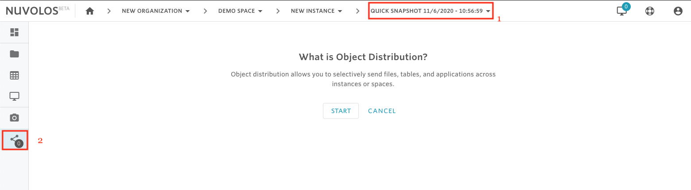
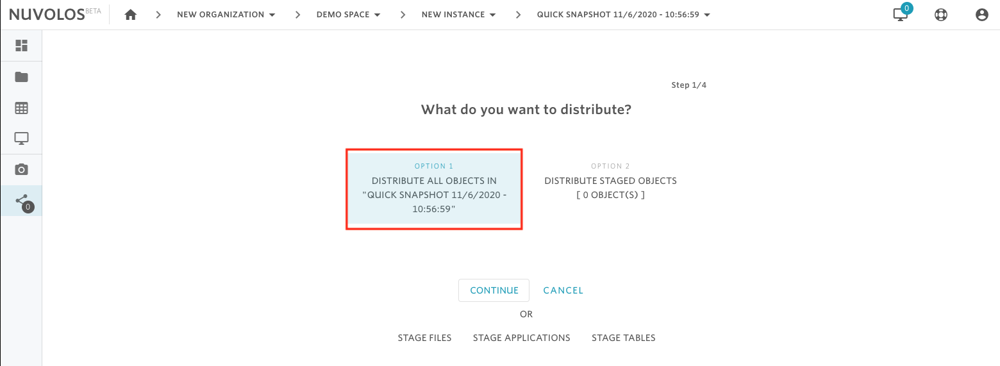

# Distribute objects in Nuvolos

Object distribution is a building-block feature of Nuvolos. The key concept to remember is that distribution is a _push-_type operation, you have to initiate it from the source and you send to the specified target. Consequently, you need **EDITOR** access on the target instance you want to write to.

The following type of objects (or a combination of these) can be distributed:

* Files, sets of files, or entire directories,
* tables or sets of tables,
* applications or sets of applications,
* or entire snapshots

## Distributing a selected list of items: a worked example

You can distribute a set of items from a single instance using the **stage** feature of Nuvolos. The stage is a temporary area for collecting objects to be distributed. Changing context (i.e. moving from a state to another) currently clears the stage, so to distribute to a target from multiple sources, a separate distribution needs to be initiated from each source.

Assume that you want to distribute a file and an application in the following example. In order to do this, the following steps need to be done:

1. Select the file you want to stage and either click **STAGE** or click **STAGE SELECTED** on the following screen:

&#x20;    2\. Select the application you want to stage by navigating to the application list and staging the appropriate one:

&#x20;    3\. Navigate to the stage area to begin distribution using the share icon on the sidebar. Observe your current set of staged objects. If everything checks out, click **CONTINUE**.  In our particular example, we have one file and one application (as selected previously) in the stage. Using the red cross button, items can be removed from the stage.

&#x20;    4\. The next step selects the target for distribution. It is possible to remain in the current context or to distribute into some other space or even organization. In the current example, we select a space in the same organization. You can also choose whether to share with all instance or just one. Once you are done finding the target, click **CONTINUE**.

5\. The next step selects the distribution strategy - more details can be found [here](distribution-strategies.md). For now, we will select overwrite, which will overwrite objects of the same name in the target.&#x20;


Please note that whenever you distribute, a snapshot gets created in the target, so you should not be concerned about data loss.


&#x20;Once done, click **CONTINUE.**

6\. Finally, you can send a message along with the distribution to notify the users in the targets about the change being made. In this particular case, we decided _not_ to notify users by emptying the checkbox.

Once you are done, click **SHARE OBJECTS** and you are done.

## Distribute an entire snapshot

To distribute all the contents of a snapshot:

1. Open the snapshot.
2. Navigate to the stage area using the sidebar.
3. Click Start
4. Select Option 1: Distribute all objects in "SNAPSHOT NAME HERE"
5. Same as step 4 above.
6. Same as step 5 above.
7. Same as step 6 above.

**Example**

Assume we are in a the Demo Space and we have a snapshot called "Quick snapshot 11/6/2020 - 10:56:59" that we want to distribute. First, from the toolbar we select the snapshot and then from the sidebar we havigate to the stage area.

Click on Start and select Option 1

Continue as described above.
