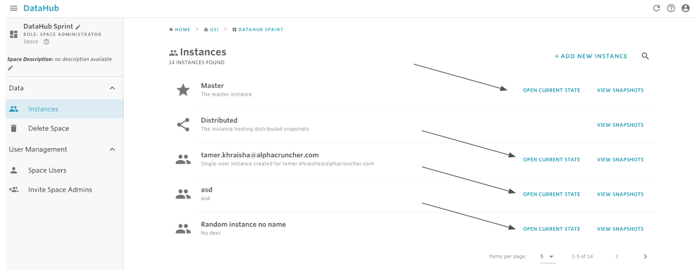
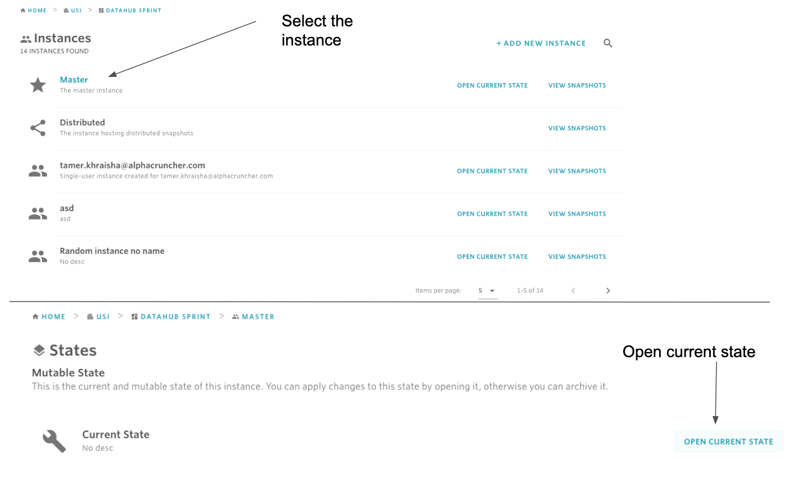
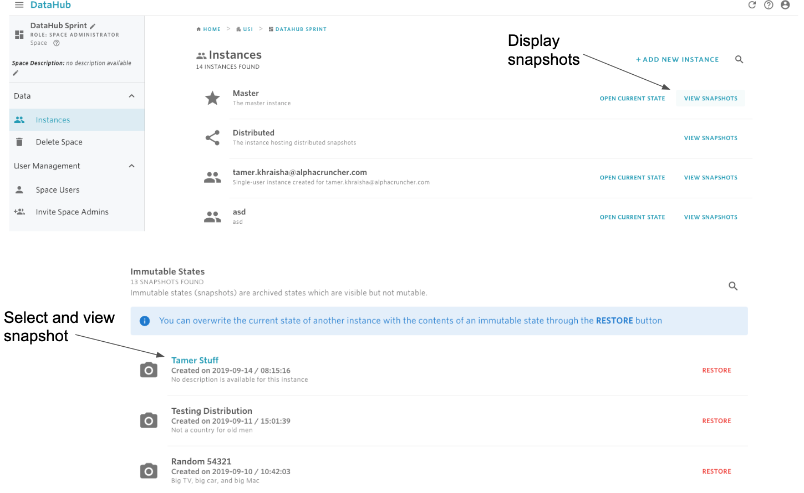

# Find a Snapshot/Current State

## To find a snapshot/Current State of an instance:

#### 1. Find the instance you want to work in.

If you have already found the instance, go to step 2. Otherwise, check the instructions [here](find-an-instance.md) on how to find an instance

#### 2. To navigate to the current state, there are two options:

**2.1**  If you are still in the space view where the instances are visualized, then you can click on **OPEN CURRENT STATE** to navigate to the current state of the selected instance.

**2.2.** If you have already selected and clicked on the instance you want to work in, then you will also see an OPEN CURRENT STATE button which you can click to navigate to the current state.

**3. To navigate to a snapshot:**

 ****  1. Identify the instance you want to work in.

   2. Click on VIEW SNAPSHOTS

   3. From Immutable Snapshots, select the snapshot you want to view.

