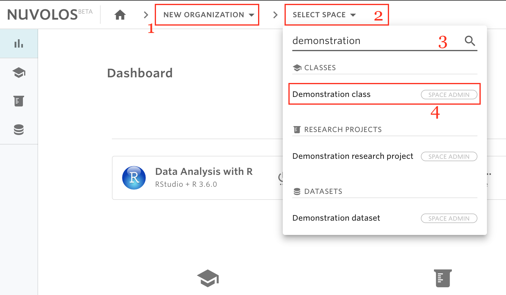

# Find a space


Nuvolos users are only able to see spaces of which you are an administrator or a member.


## To Find an organization:

1. Make sure you have selected the organization where the space is located.
2. Click on the second list item from the toolbar breadcrumbs.
3. From the list, you can find the space you are looking for either by scrolling the list or by using the search field. The list of space is divided into classes, research projects, and datasets.

For example, assume we want to find a space called "Demonstration Class" in an organization called "New Organization". From the breadcrumbs, we first select the "New Organization" organization, then we search for the word "Demonstration", and finally select the space called "Demonstration Class"

