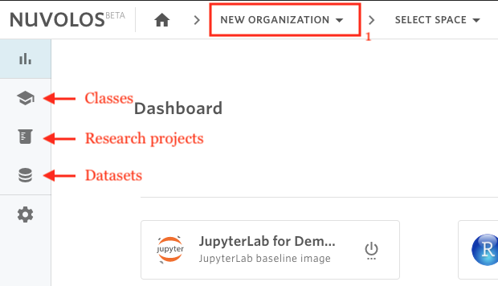

# Find a space


Nuvolos users are only able to see spaces of which you are an administrator or a member.


## To Find a space, there are two options:

### **- Via the toolbar breadcrumbs:**

1. Select the organization where the space is located.
2. Click on the second list item from the toolbar breadcrumbs.
3. From the list, you can find the space you are looking for either by scrolling the list or by using the search field. The list of space is divided into classes, research projects, and datasets.

**Example**

Assume we want to find a space called "Demonstration Class" in the "New Organization" organization.

1. From the breadcrumbs, select the "New Organization" organization.
2.  Open the space list.
3.  Search for the word "demonstration".
4. Select the space called "Demonstration Class"

### - Via the list of spaces

1. Select the organization where the space is located using the toolbar breadcrumbs.
2. Using the sidebar, you can visualize the list of classes, research projects, or datasets.

**Example**

