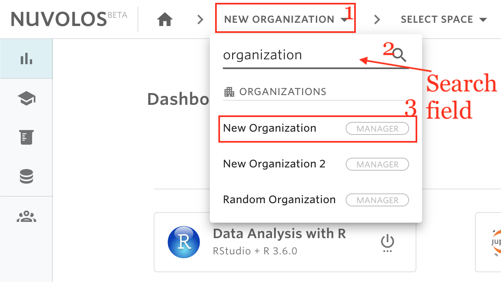

# Find an organization


Nuvolos users are only able to see organizations for which they have accepted a valid invitation to.


## To Find an organization:

1. Click on the first list item from the toolbar breadcrumbs.
2. From the list, you can find the organization you are looking for either by scrolling the list or by using the search field.

## Example

Assume we want to find an organization called "New Organization". If we type "organization" in the search field, then we can find all organizations which contain the word "organization" and locate "New Organization"

