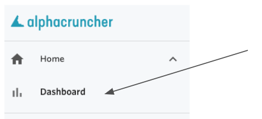
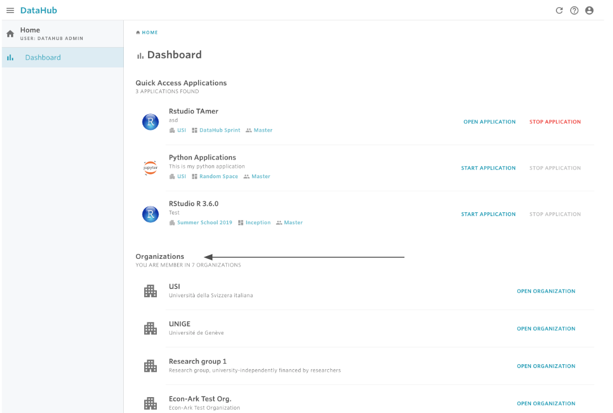

# Find an organization

Nuvolos users are only able to see organizations for which they have accepted a valid invitation to.

## Finding an organization

#### 1. Navigate to the home dashboard.

If you are already in the home dashboard, then go to step 2. If you are not currently viewing the dashboard, then you use the hamburger button \(three-lines icon in the top-left corner\) of the DataHub toolbar to toggle the navigation menu.

 From the navigation menu, click the Dashboard tab.

**2. Using the Dashboard, you can view and select an organizations under Organizations.**

