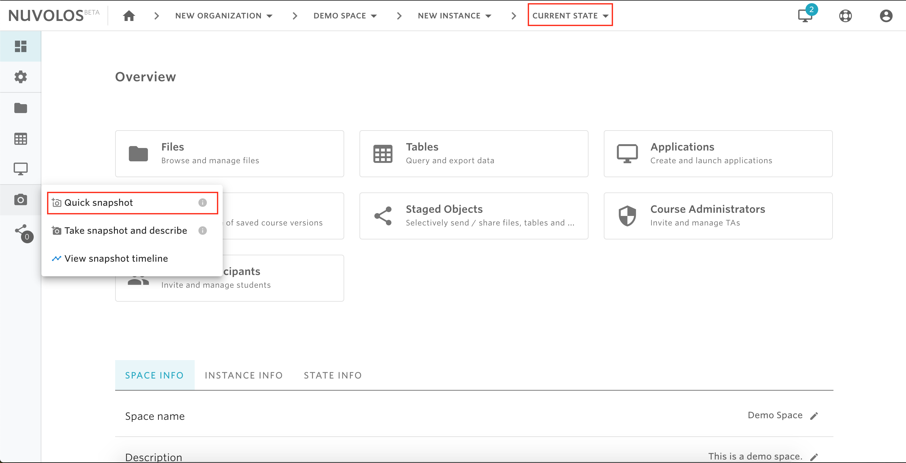
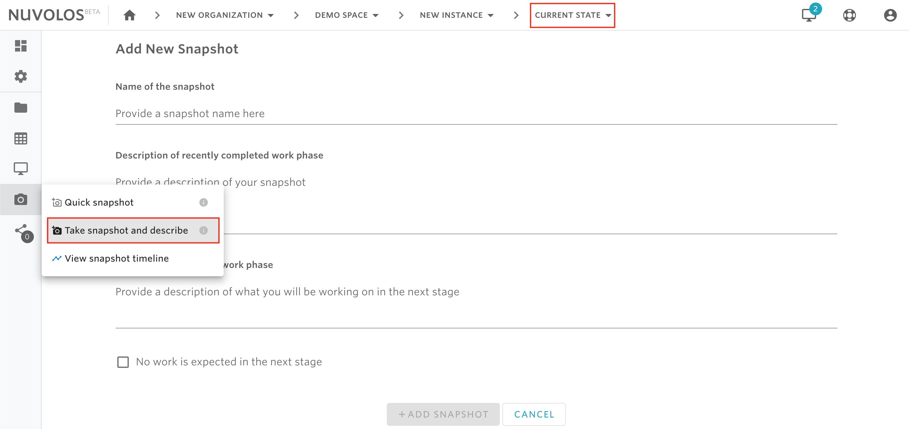

# Create a snapshot


There are two types of snapshots that the user can create:

* **Quick snapshot:** represents a quick option to snapshot the current state of an instance.
* **Detailed snapshot:** a snapshot with user-provided description and a summary of what will be the next work phase in the current state.


## **To create a quick snapshot:**

1- Make sure you are viewing the current state of an instance.

2- From the left sidebar, hover on the camera icon and click on "Quick Snapshot"

## To create a detailed snapshot

1- Make sure you are viewing the current state of an instance.

2- From the left sidebar, hover on the camera icon and click on "Take snapshot and describe"

3- Provide a name of the snapshot, a description, and a short summary (if any) of the next work phase that will describe the Current State.

4- Click ADD SNAPSHOT.

#### If you are encountering a problem creating a snapshot, refer to the troubleshooting guide [here](../../troubleshooting/authorization-issues/cannot-create-a-snapshot.md).

****
