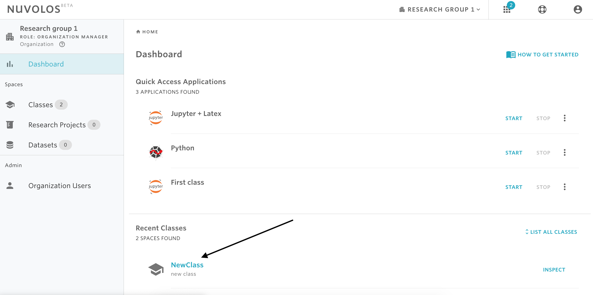
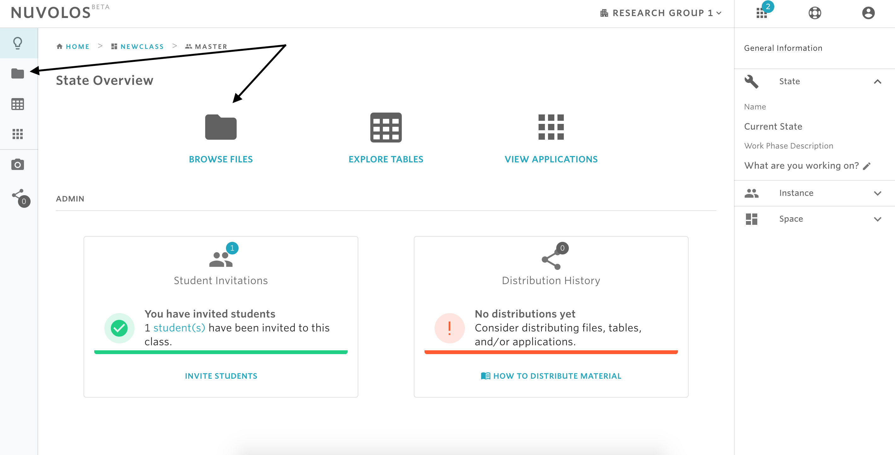
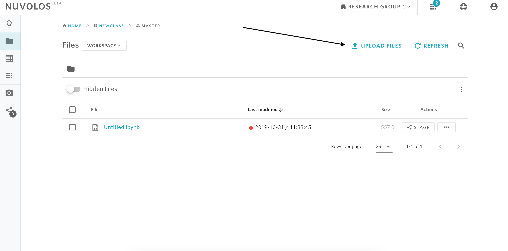
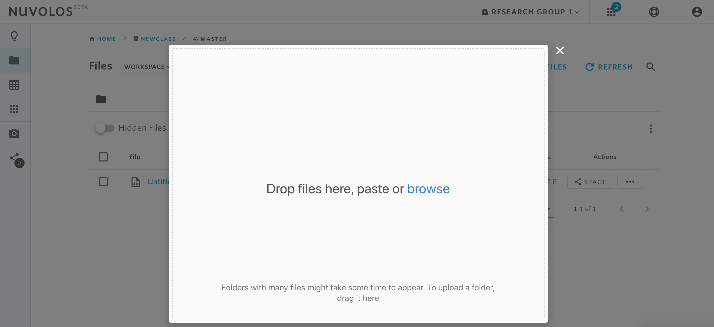

# Upload new files


Uploading files is possible only to the current state of an instance. You cannot upload files to a snapshot.

Before uploading new files, make sure the right privileges are granted: only _instance editors_ are allowed to upload new files to a current state.


**To upload new files:**

1- Open a class, research project, or a dataset from the dashboard. This can be done by clicking on the name of the space.

2- Go to the files view by clicking on the BROWSE FILES button from the main view, or via the file icon from the left sidebar.

3- Click on the **UPLOAD** button, and an upload box will appear.

It is possible to drag-and-drop files to the upload box, or to click _Browse_ in order to select local files to upload.


To upload folders, drag the folder from your local machine to the upload box.


4- Once files are selected for upload, click on the **UPLOAD FILES** button that appears at the bottom.


#### If you are encountering a problem deleting a space, refer to the troubleshooting guide [here](../../troubleshooting/authorization-issues/cannot-upload-a-file.md).


