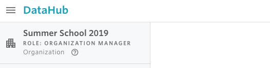

# Know my role

Nuvolos has a variety of roles that can be assigned at the organization, space, and instance level. Being at any of these three levels, your role will always be displayed in the top-left part of the sidebar. For example, the screenshot below shows that the user is an organization manager in the organization _Summer School 2019_.

