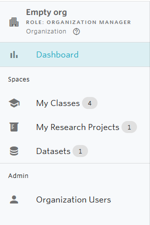
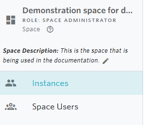

# Navigate in Nuvolos

Navigation in Nuvolos is closely linked to the [structure of Nuvolos](../data-organization/). You can understand your position and navigate using the following highlighted parts of the user interface.

1. The **Nuvolos** logo
2. The **breadcrumbs**
3. The **navigational sidebar**

### The Nuvolos logo

The nuvolos logo will always take you to your _Dashboard._

## The breadcrumb

The breadcrumb is a sequence of selectable lists that allows you to choose the organization \(level 1\), space \(level 2\), instance \(level 3\), and state \(level 4\). For example, if you are looking at a state overview, the breadcrumb will look like the following:

In the above breadcrumb, you can find the following information:

* You are currently in the "NEW ORGANIZATION" organization.
* You are currently in the "NO NAME" space of inside your organization.
* Inside the space, you are currently working in the "MASTER" Instance.
* Inside "MASTER", you are working with the "CURRENT STATE", which is the mutable state.

As visible, the breadcrumb can take you either to your Dashboard \(via the home icon\), or you can change the organization, space, instance, or snapshot:

* If you change the organization, you will be taken to the dashboard and the you will have to select which space you want to work in.

## The sidebar

The navigational sidebar has two forms, an expanded form on management and navigation screens and a compact form on state overview screens and while you are working in applications.

### Expanded form

In the expanded form, the sidebar varies according to context. 

On the top level, the sidebar will look similar to this:

Visibly, the Dashboard line is highlighted, making clear that the user is currently viewing the Dashboard of Nuvolos. Clicking on any of the lines, either a list of spaces will be visible, or the list of Organization Users \(granted that the viewer has access\).

On the space level, the sidebar will be different:

Visibly, currently the 'Instances' element is selected, pointing to the fact that the user is currently viewing the list of instances in the space. Switching to 'Space Users' will show the list of users that have some specific role in the space being selected.

### Compact form

The compact sidebar is used in state level work, or when the user is doing work in an application.

It looks similar to this:

From top to bottom the icons will transport the user to the following views \(also visible by hovering over an icon\):

* Overview
* Files
* Tables
* Applications
* Snapshot creation
* Staging and distribution

Similar to the expanded sidebar, the currently active view is highlighted with a darker background.

## The organization selection

Organizations serve as the highest [structural level](../data-organization/) in Nuvolos. Depending on which organization you are working in, you will be able to access different datasets, different research projects and classes. Consequently, if you cannot find a certain project, always check the organization selection that is available on top.

