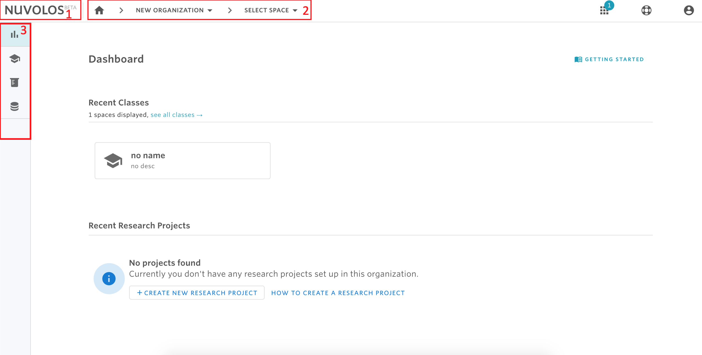
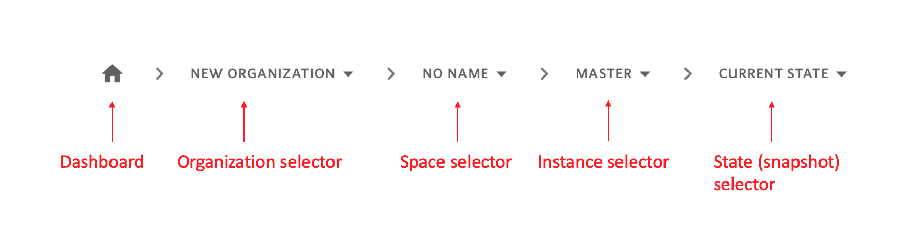
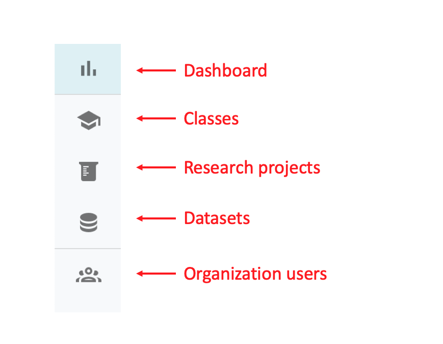
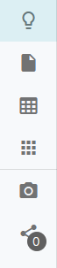

# Navigate in Nuvolos

Navigation in Nuvolos is closely linked to the [structure of Nuvolos](../data-organization/). The user can understand their position and navigate using the following highlighted parts of the user interface.

1. The **Nuvolos** logo
2. The **breadcrumbs**
3. The **navigational sidebar**

### The Nuvolos logo

The nuvolos logo will always take the user to the _Dashboard._

## The breadcrumb

The breadcrumb is a sequence of selectable lists that allows the user to choose the organization \(level 1\), space \(level 2\), instance \(level 3\), and state \(level 4\). For example, if the user is looking at a state overview, the breadcrumb will look like the following:

In the above breadcrumb, the following information is available:

* The user is currently in the "NEW ORGANIZATION" organization.
* The user is in the "NO NAME" space inside the organization.
* Inside the space, the user is working in the "MASTER" Instance.
* Inside "MASTER", the user is working with the "CURRENT STATE", which is the mutable state.

As visible, the breadcrumb can take the user either to the Dashboard \(via the home icon\), or the user can change the organization, space, instance, or snapshot where one of the following could happen:

* If the user changes the organization, then the interface will redirect to the dashboard and a space needs to be selected.

* If the user changes the space, then three scenarios are possible:
  * If the user is an administrator of the space, then they will be taken to the "CURRENT STATE"  state of the "MASTER" instance of the selected space.
  * If the users is not a space administrator but has an editor role in one of the instances, then they user will be taken to the "CURRENT STATE" state of that instance.
  * If the user are not a space administrator or an instance editor, then they will be taken to one of the immutable states of an instance where the user is a viewer.

## The sidebar

There are two navigational sidebars in Nuvolos: the dashboard sidebar and the state-level sidebar.

### Dashboard sidebar

From the dashboard, the sidebar will look similar to this:

Visibly, the Dashboard icon is highlighted, making clear that the user is currently viewing the Dashboard of Nuvolos. Clicking on any of the other icons, either a list of spaces will be visible, or the list of Organization Users \(granted that the viewer has access\).

### Compact form

The compact sidebar is used in state level work, or when the user is doing work in an application.

It looks similar to this:

From top to bottom the icons will transport the user to the following views \(also visible by hovering over an icon\):

* Overview
* Files
* Tables
* Applications
* Snapshot creation
* Staging and distribution

Similar to the expanded sidebar, the currently active view is highlighted with a darker background.

## The organization selection

Organizations serve as the highest [structural level](../data-organization/) in Nuvolos. Depending on which organization you are working in, you will be able to access different datasets, different research projects and classes. Consequently, if you cannot find a certain project, always check the organization selection that is available on top.

