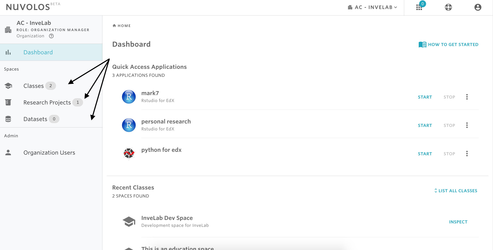
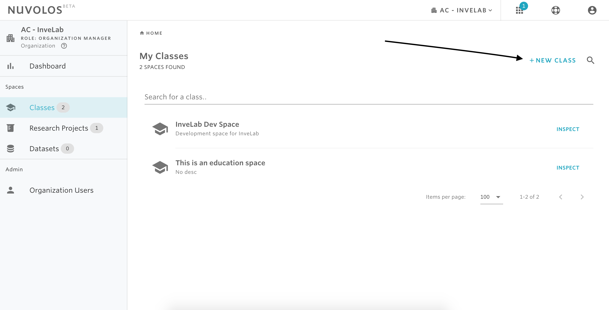
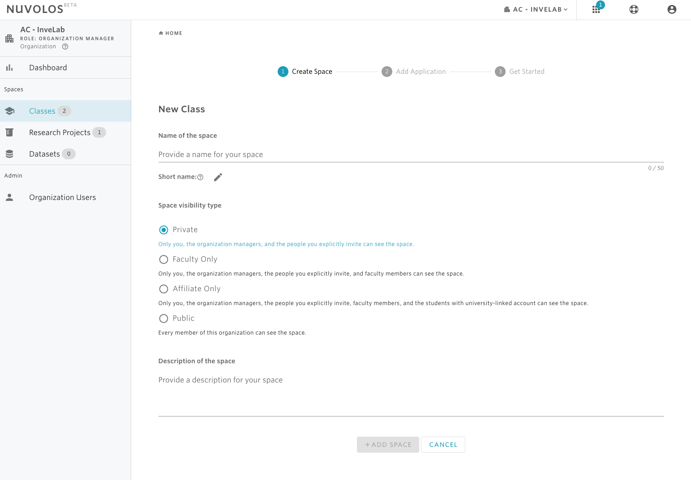
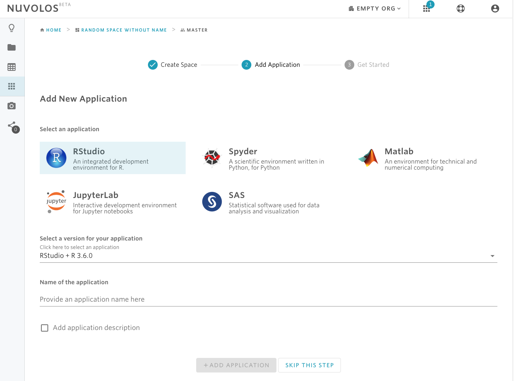

# Create a space


**Only organization managers and faculty members are allowed to create spaces.** 


## To create a new space

1- Navigate to the dashboard.

2- From the left sidebar, select Classes, Research Projects, or Datasets depending on the type of class you want to create.

3- From the top-right, click on NEW CLASS, NEW RESEARCH PROJECT, OR NEW DATASET.

4- Provide a name of the space.

5- Select the space type.

6- Provide a description of the space.

4- Click on the ADD SPACE button.

5- Once the space has been successfully created, you will be offered the option to create an application. If you want to create an application, then choose the application, the version, give it a name, and then click ADD APPLICATION. Otherwise, you can skip this step via the SKIP THIS STEP button.

6- Finally, you will be redirected to a view where you can decide what to do next: add files, launch the application you have just created, or invite users.

#### If you are encountering a problem creating a space, refer to the troubleshooting guide [here](../../troubleshooting/authorization-issues/cannot-create-a-space.md).

\*\*\*\*

