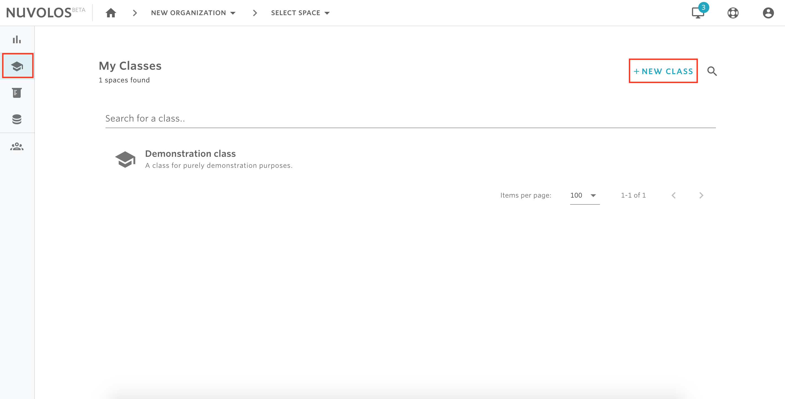
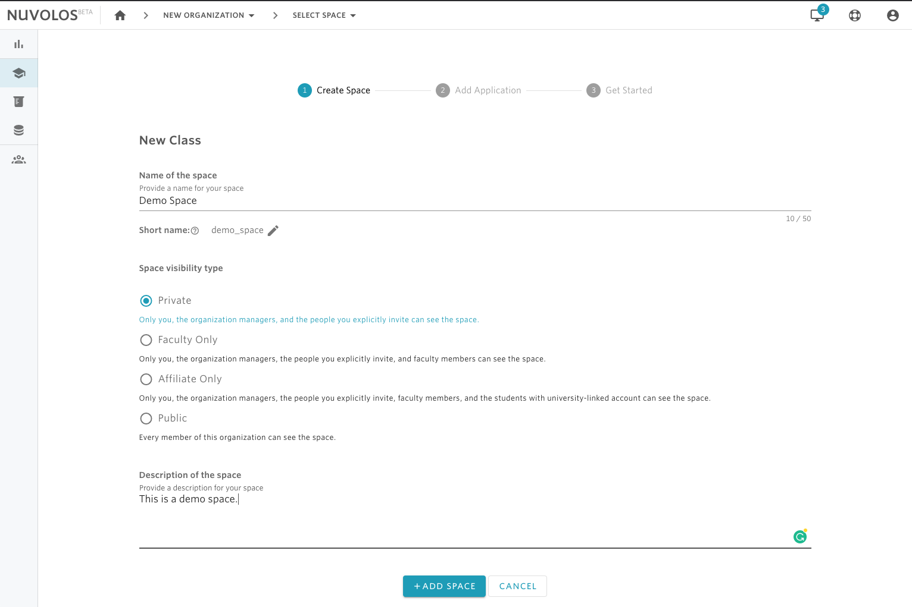
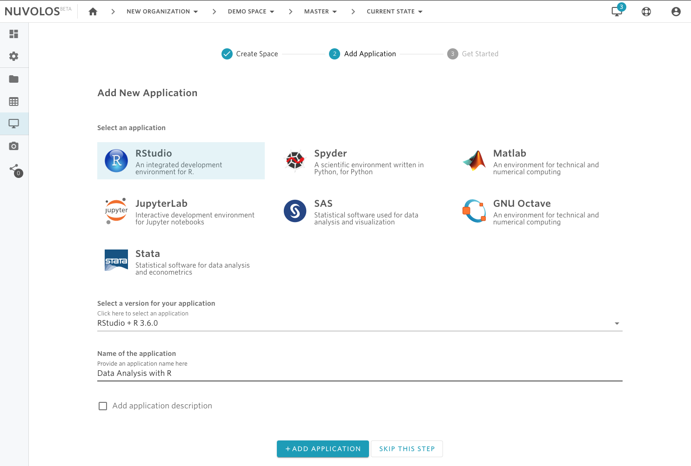

# Create a space


Only organization managers and faculty members are allowed to create spaces. 


## To create a new space

1- Navigate to the home \(dashboard\) view via the home icon from the breadcrumbs in the top toolbar.

2- Decide on the type of space you want to create: class, research project, or a dataset.

* To create a class, select classes from the left sidebar.
* To create a research project, select research projects.
* To create a dataset, select datasets.

2- Assume we want to create a class. Then by clicking on the school hat icon in the sidebar, the list of classes will be displayed. From the top right, click "NEW CLASS"

3- Provide a name of the space, select the space type, and provide a description of the space, and finally click ADD SPACE. Let's create a private class called  "Demo Space".

4- Once the space is created, an optional step asks the user whether they want to create an application in the newly created space. In our case, let's create an RStudio application with R 3.6.0 version and call it "Data Analysis with R".

4- Click on the ADD SPACE button.

5- Once the space has been successfully created, you will be offered the option to create an application. If you want to create an application, then choose the application, the version, give it a name, and then click ADD APPLICATION. Otherwise, you can skip this step via the SKIP THIS STEP button.

6- Finally, you will be redirected to a view where you can decide what to do next: add files, launch the application you have just created, or invite users.

#### If you are encountering a problem creating a space, refer to the troubleshooting guide [here](../../troubleshooting/authorization-issues/cannot-create-a-space.md).

\*\*\*\*

