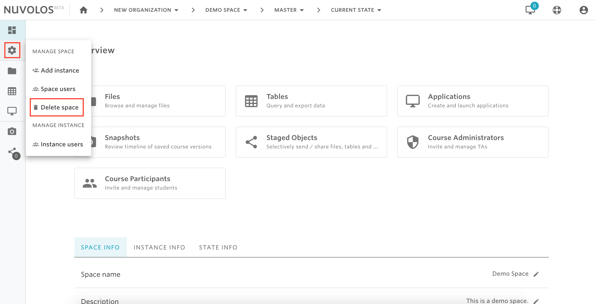
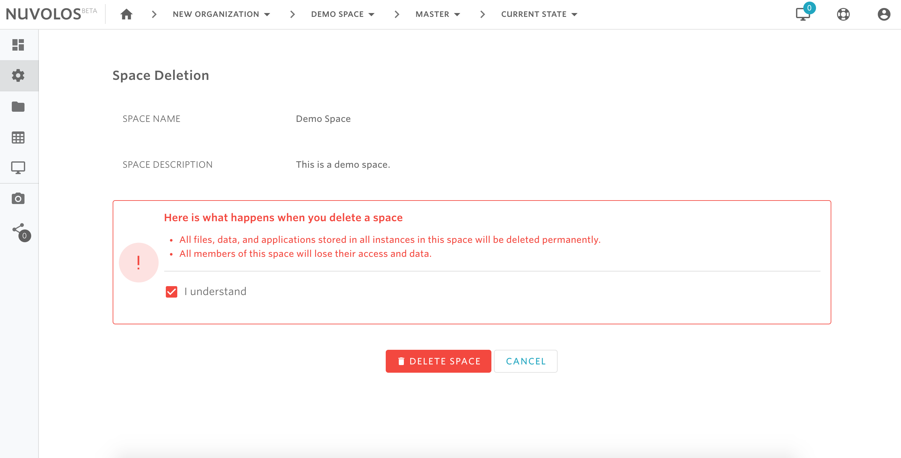

# Delete a space


Only space administrators and organization members


## **To delete a space:**

1- Open the space by selecting it from the toolbar breadcrumbs or from the dashboard. For example, let's say we want to delete a space called "Demo Space". By clicking on Demo Space, this will take us to the overview view.

  
2- From the left sidebar, hover on the settings icon and select Delete Space

3- Read the warning message, click "I understand", and then click DELETE SPACE.

#### If you are encountering a problem deleting a space, refer to the troubleshooting guide [here](../../troubleshooting/authorization-issues/cannot-delete-a-space-1.md). 

\*\*\*\*

\*\*\*\*

