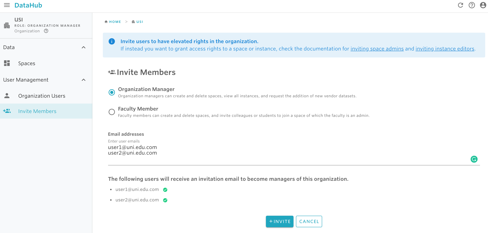

# Invite organization members

At the organization level, there are two types of permission that can be granted: organization manager and organization faculty. For details on the types of rights each of these roles has, please read [here](../../data-organization/organizations.md).

Before granting access rights to an organization, make sure that the right permissions are set. Only organization managers are allowed to grant access right for an organization.

## **To invite an organization member:**

1. Find and select the organization you want to invite members to. For instructions on how to find an organization, check the documentation available [here](../find-objects-in-nuvolos/find-an-organization.md). 
2. From the sidebar on the left, click on **Invite Members.** 
3. Select the type of invitation you want to send \(managers or faculty\). 
4. Provide the emails of the users you want to invite to the organization. 
5. Click on **Invite**.

