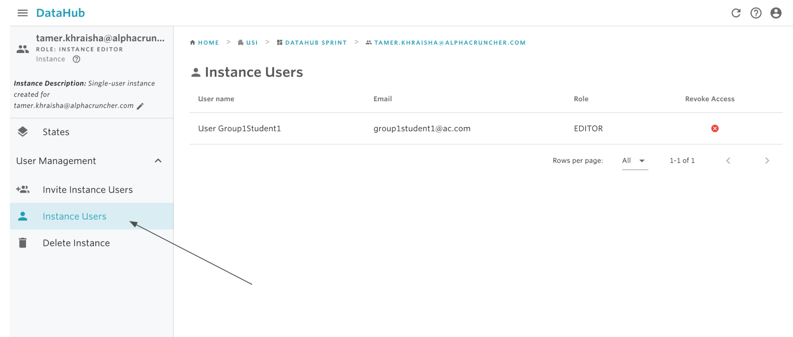
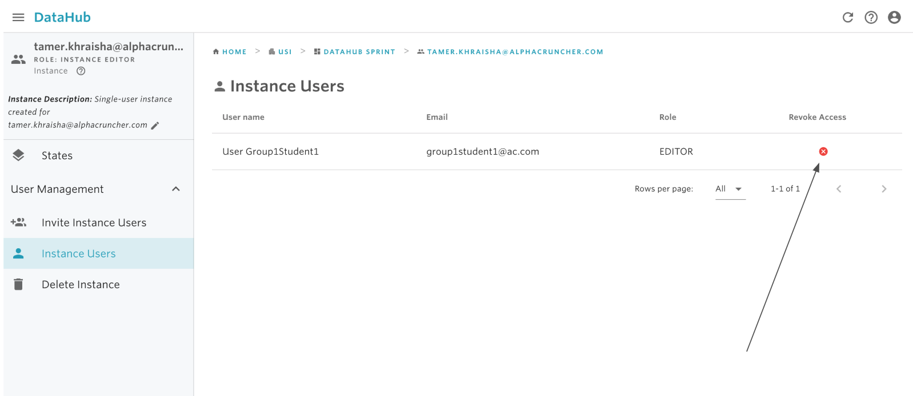
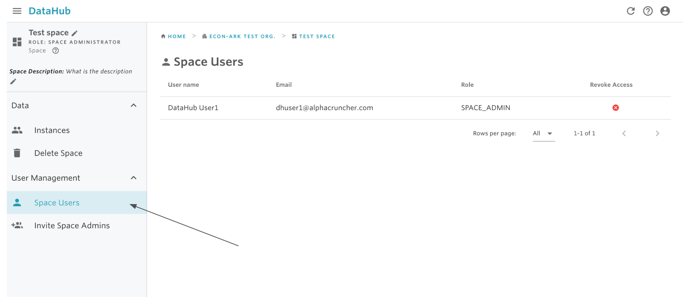
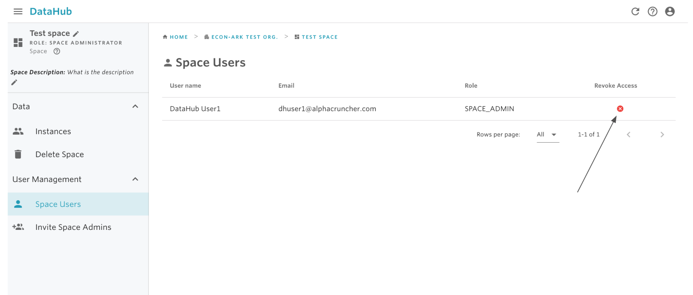
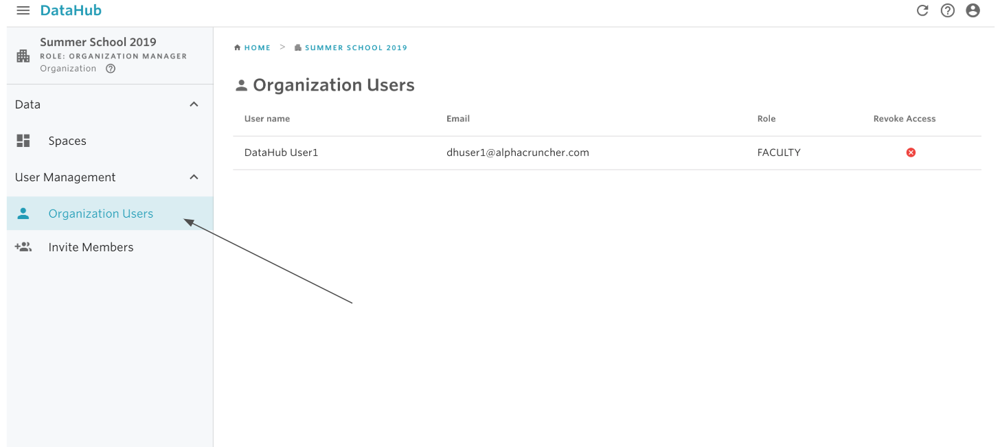
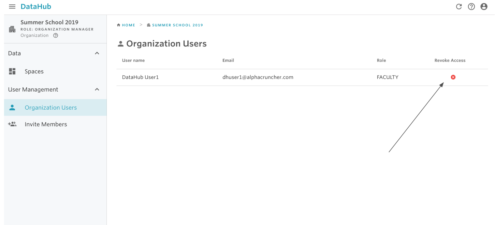

# Revoke user access

## 1. Remove user from instance.

Only space administrators have the permission to remove users from an instance.  
  
You can only remove explicit users from this view. For example, you cannot remove other space administrator from a single instance. To do so, please use the remove user from space.  

#### To remove a user from an instance:

1. Select the instance.

2. From the sidebar, select Instance Users

3. Identify the user you want to remove and click on the red cancel button under Revoke Access.

4. Confirm using the REVOKE button.

## 2. Remove user from space.

Only space administrators have the permission to remove users from a space.  
  
Removing a user from a space will result in the user losing his space administrator role \(if any\) as well as all editor/viewer roles in any of the space instances.  
  
**To remove a user form an space:**

1. Select the space.

2. From the sidebar, select Space Users.

3. Identify the user you want to remove and click on the red cancel button under Revoke Access.

4. Confirm using the REVOKE button.

## 3. Remove user form organization.

Only organization managers have the permission to remove users from the organization.

Removing a user from an organization will result in the user losing his organizational role, and will be removed from all spaces.

#### To remove a user form an organization:

1. Select the organization from the home dashboard.

2. From the sidebar, select Organization Users.

3. Identify the user you want to remove and click on the red cancel button under Revoke Access.

4. Confirm using the REVOKE button.

