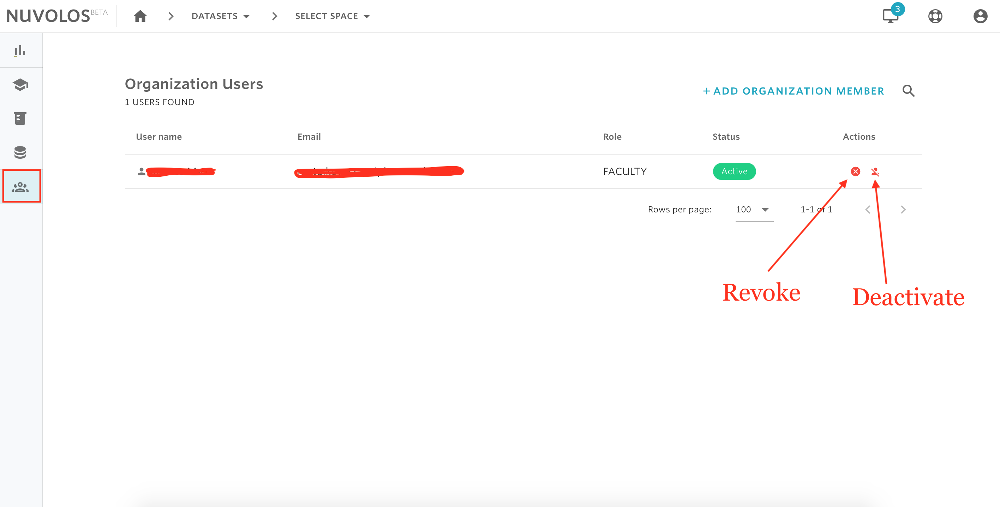

# Revoke or deactivate users


An organization manager can revoke or deactivate any organization member.

* **Revoke** will simply revoke the organization role from the user. User account and instances/snapshots are not deleted, only the affected users won't see them anymore.
* **Deactivate** blocks user login, so it's a user-global operation.


## To revoke or deactivate an organization member:

1. Go to the home\(dashboard\) view and, using the left sidebar, click on the users icon.
2. Identify the user\(s\) you want to revoke/deactivate.
3. To revoke, click the red delete button, and to deactivate click on the red user cancel account button.

