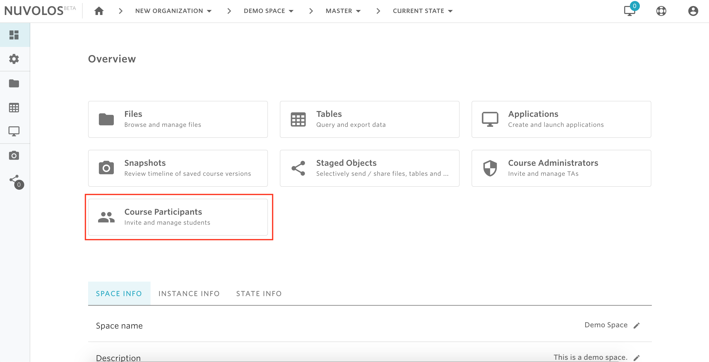
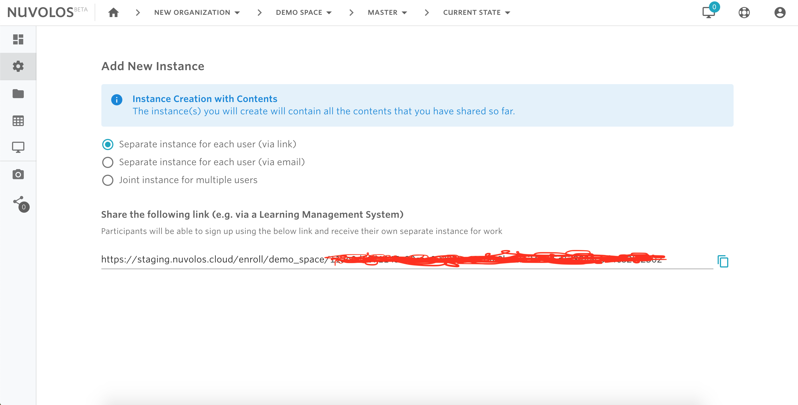
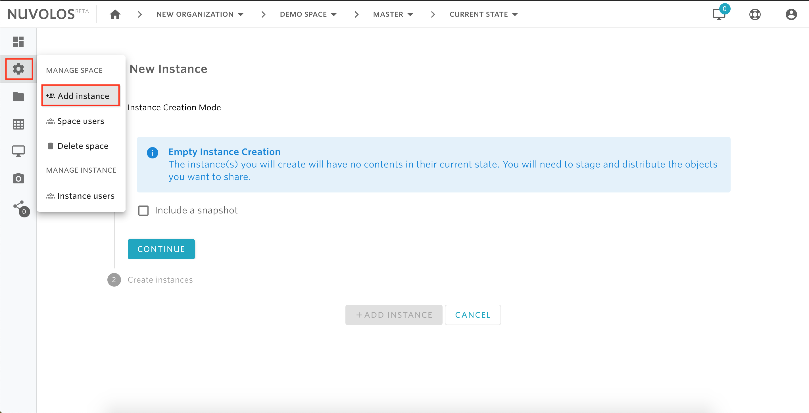

# Create an instance


Only space administrators are allowed to create new instances in their space.


## **There are two options to create an instance:**

### **Option1: Create instance\(s\) that contains the latest objects you have distributed.**

If you have already performed object distributions to all instance in a space, then one or more snapshots of what has been distributed will be stored in the Distributed instance \(see  [here](../distribute-objects-in-nuvolos/) for details\). To invite a new user to a space and upload the latest distributed snapshot to the current state of the new user, then the following steps are required:

1- Open a class or research project. For example, let's open the class called Demo Space and invite students to this space.

2- From the overview screen, click on "Course Participants" \(or "Project Participants" if you are in a research project\).

3- Choose the type of instance you want to create.

* **Separate instance for each user**: With this option, a link will be shown that can be copied and made available to all users who should join the space. Upon opening this link, each student will be asked to provide their institutional email to which an invitation will be sent. By opening the invitation email, the student will be able to sign up for Nuvolos and join the class. This option would be preferred when a professor wants to invite multiple students to join a class.


For research projects, the option **Separate instance for each user** does not support the invitation via link and requires instead a list of user emails and does not support the invitation via link.


* **Joint instance for multiple users**: this option requires a list of emails and only one single instance will be created and shared by all users whose emails were provided. This option requires a name and description for the new instance. Joint instances are designed to facilitate group work: group assignments, or small group research activities are best carried out in joint instances.
* **Single instance \(not available for this instance creation mode\)**: with this option, a single instance will be created for the current space administrator. An instance name and description needs to be provided to complete the operation.


If you haven't distributed any material to all students, you can still continue with this option and later distribute material to the invited members.


### **Option 2: Create instance regardless of the content.**

Nuvolos allows you to create instances and invite users regardless of whether you want to include content to the new instances or not.

1- Same as step 1 above

2- From the left sidebar, hover on the settings icon and click "Add Instance":

2- If you want to add content to the newly created instance\(s\), then select a snapshot by checking the "Include a snapshot" box. Otherwise, click on "CONTINUE"

3- Choose the type of instance you want to create. Same as the previous option but with the only difference is that the "separate instance for each user" option requires a list of emails rather than providing a link.

#### If you are encountering a problem creating an instance, refer to the troubleshooting guide [here](../../troubleshooting/authorization-issues/cannot-create-an-instance.md).

\*\*\*\*

\*\*\*\*

