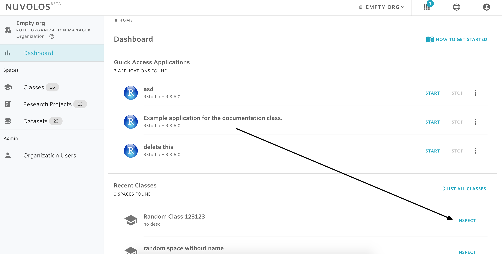
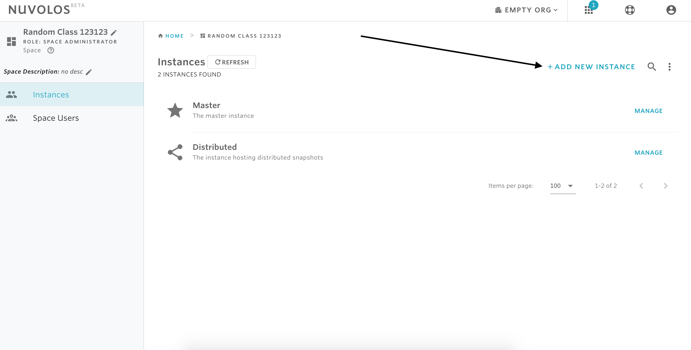
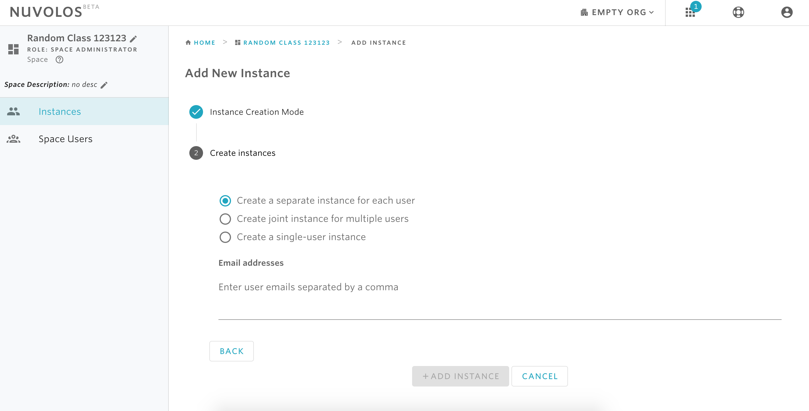

# Create an instance


Only space administrators are allowed to create new instances in their space.


## **There are two options to create an instance:**

### **Option1: Create instance\(s\) that contains the latest objects you have distributed.**

If you have already performed object distributions to all instance in a space, then one or more snapshots of what has been distributed will be stored in the Distributed instance \(see  [here](../distribute-objects-in-nuvolos/) for details\). To invite a new user to a space and upload the latest distributed snapshot to the current state of the new user, then the following steps are required:

1- Open a class or research project. For example, let's open the class called Demo Space and invite a student to this space.

2- From the overview screen, click on COURSE PARTICIPANTS

3- Choose the type of instance you want to create.

* **Separate instance for each user**: this option requires a list of emails and a single new instance will be created for each email address. The owner of each email address will receive an invitation to join the space and work with their own instance. This option would be preferred when a professor wants to invite multiple students to join a class.
* **Joint instance for multiple users**: this option requires a list of emails and only one single instance will be created and shared by all users whose emails were provided. This option also requires a name and description for the new instance. Joint instances are designed to facilitate group work: group assignments, or small group research activities are best carried out in joint instances.
* **Single instance \(not available for this instance creation mode\)**: with this option, a single instance will be created for the current space administrator. An instance name and description needs to be provided to complete the operation.


If you haven't distributed any material to all students, you can still continue with this option and later distribute material to the invited members.


3- Provide the list of emails separated by comma, e.g., **one@school.com, two@school.com, three.school.com**

4- Click on the **Add Instance** button.

### **Option 2: Create instance regardless of the content.**

Nuvolos allows you to create instances and invite users regardless of whether you want to include content to the new instances or not.

1- From the dashboard, select the class or research project you want and click on INSPECT.

2- On the top-right, click on + **ADD NEW INSTANCE.**

3- Select whether you want to include the contents of a snapshot in the new instances or not \(the default is without snapshot\), and then click CONTINUE.

4- Choose the type of instance you want to create.


The first two instances types, separate instances for each user and joint instance, require user emails separated by a comma. The third type, single-user instance, does not require a user email.


#### If you are encountering a problem creating an instance, refer to the troubleshooting guide [here](../../troubleshooting/authorization-issues/cannot-create-an-instance.md).

\*\*\*\*

\*\*\*\*

