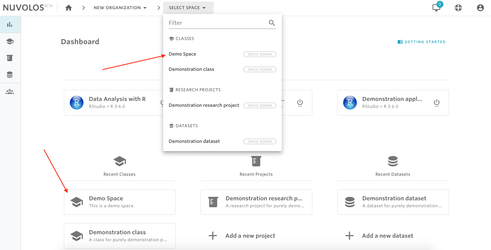
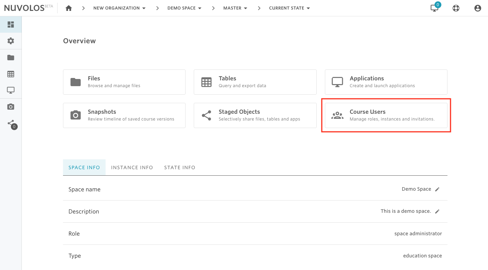
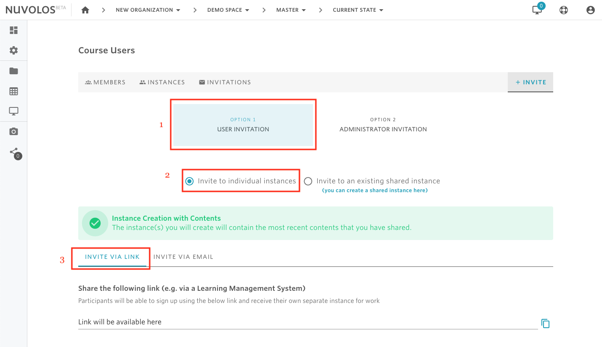
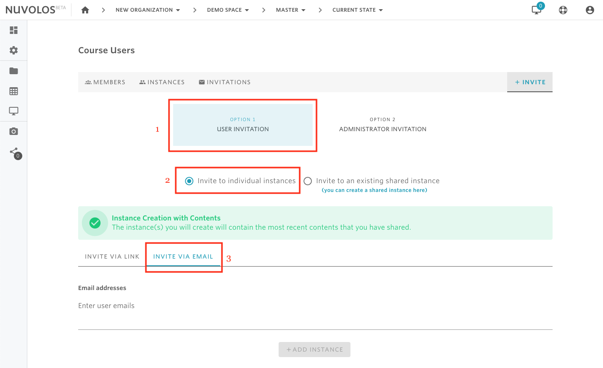
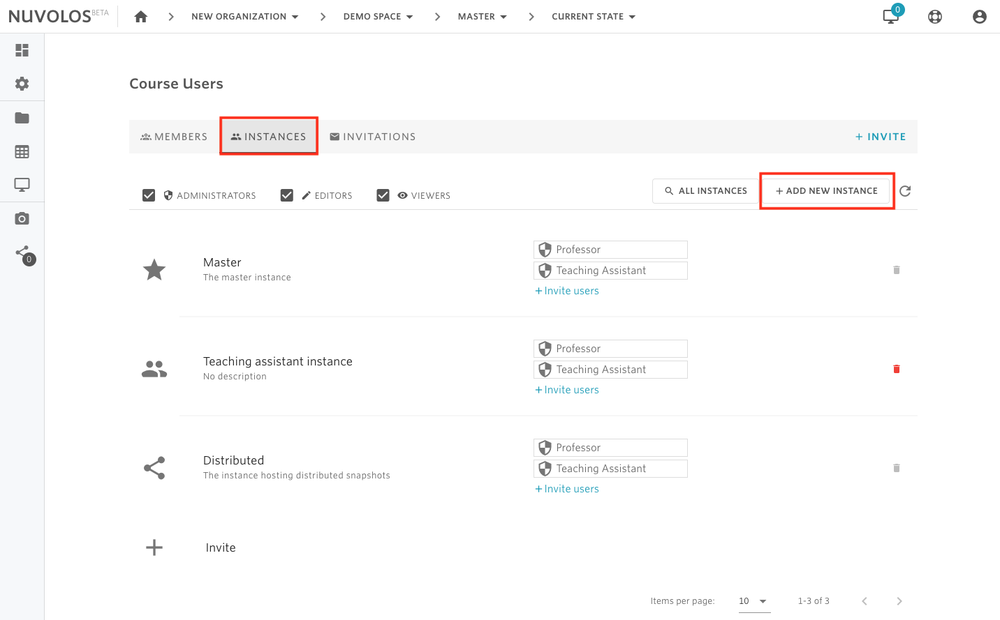
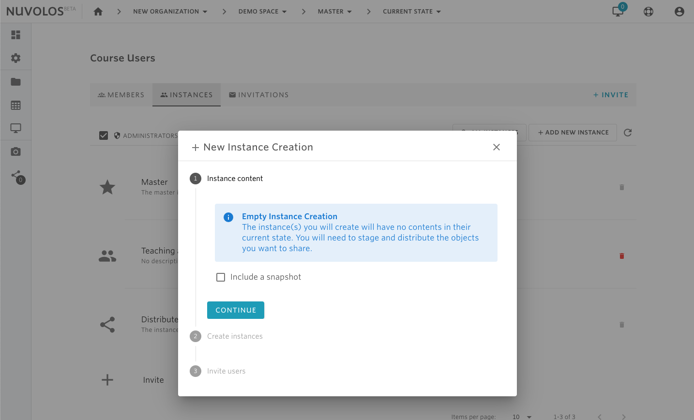
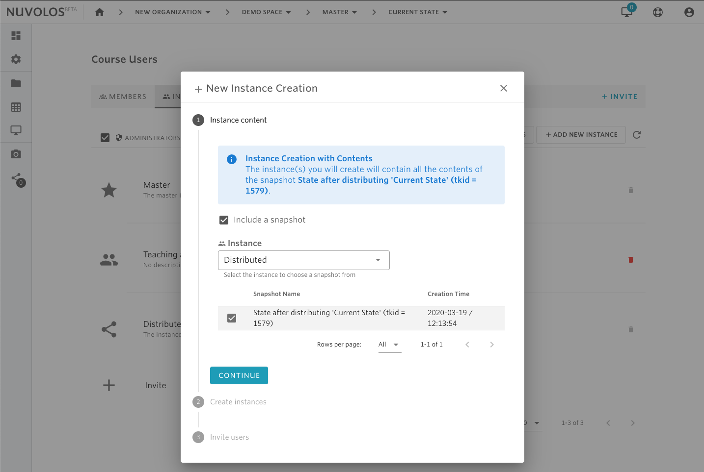
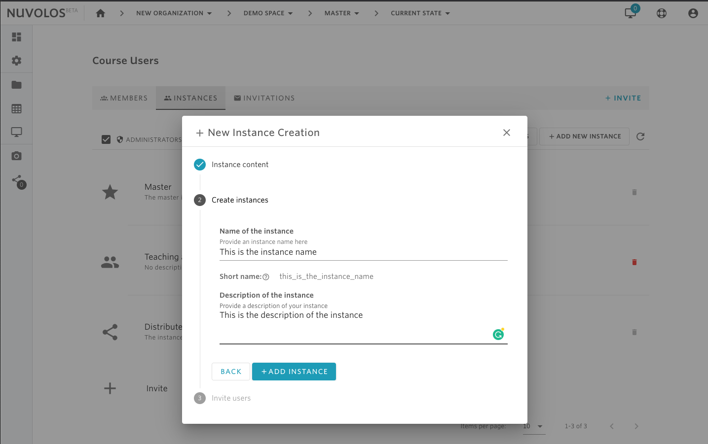
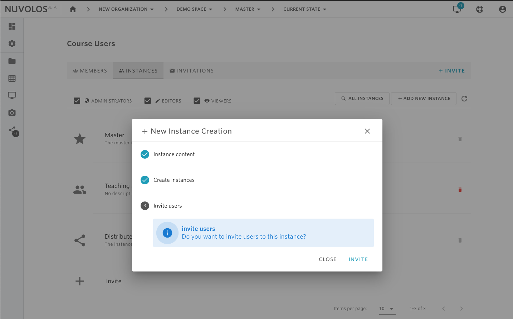

# Create an instance


Only space administrators are allowed to create new instances in their space.


## **There are two options to create an instance:**

### **1- Create a separate instance for each user via an invitation \(available for education spaces only\).**

1. Open a class. In the following example, we open the class called _Demo Space_.

    2. From the overview screen, click on the "Course Users" tile

   3. Choose Option 1 \(User Invitation\) and then select the "Invite to Individual Instances" radio button. 

   4.  Select one of two methods to invite students:

* **Invite via link**: a shareable link that students can use to self-signup. The link should be shared with all students that need invitation.

* **Invite via email**: This option requires a list of emails of the students that will be invited.


If you haven't distributed any material to all students, you can still continue with this option and later distribute material to the invited members.


### **2- Create single instance.**

1. Open a class or research project. In the following example, we open the class called Demo Space and invite students to this space.

 2. From the overview screen, click on the "Course Users" tile \("Project Users" for research projects\)

   3. Using the tabs on the top, select INSTANCES.

   4. Click the ADD NEW INSTANCE button.

  5. Decide whether you want to add the contents of an existing snapshot to the new instance. If yes, then click on the "Include a snapshot" button. Otherwise, click Continue.

  6. Provide a name and a description of the instance.

7. Finally, if you want to invite users to the newly created instance, then click on INVITE, otherwise click on CLOSE. If you click on INVITE, then you can follow the steps detailed [here](invite-instance-users.md) for inviting users.

#### If you are encountering a problem creating an instance, refer to the troubleshooting guide [here](../../troubleshooting/authorization-issues/cannot-create-an-instance.md).

\*\*\*\*

\*\*\*\*

