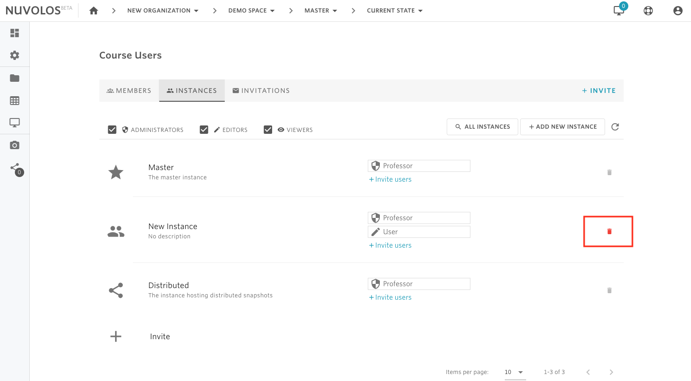
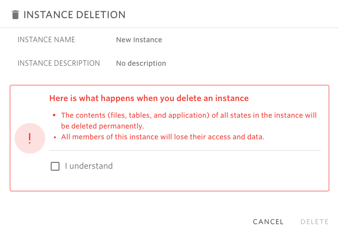

# Delete an instance


* Only space administrators are allowed to delete an instance.
* The Master and Distributed instances cannot be deleted.


## **To delete an instance:**

1- Open the space where the instance is located \(using the breadcrumbs in the toolbar\).

2- From the overview screen, click on "Course Users" \(if education space\), "Project Users" \(research space\), or "Dataset Users". Assume we are in a class called Demo Space and we want to invite a user as an editor of the Master instance.

2- Using the tabs, navigate to INSTANCES.

3- Locate the instance you want to delete to and click the red bin icon on the right:

4- A dialog window will open where the user has to confirm the operation:

5- Check the "I understand" box

6- Finally, click on **DELETE.**

#### If you are encountering a problem deleting a space, refer to the troubleshooting guide [here](../../troubleshooting/authorization-issues/cannot-delete-an-instance.md).

\*\*\*\*

