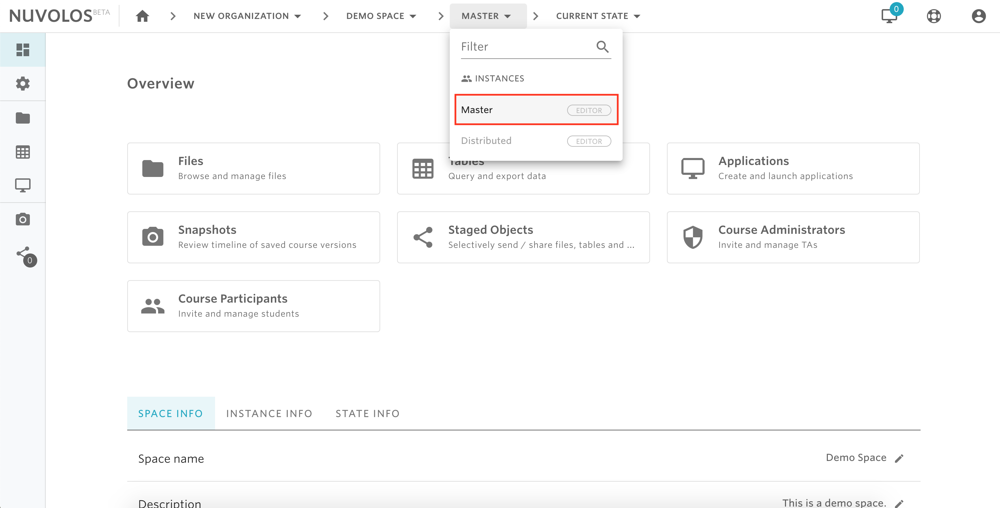
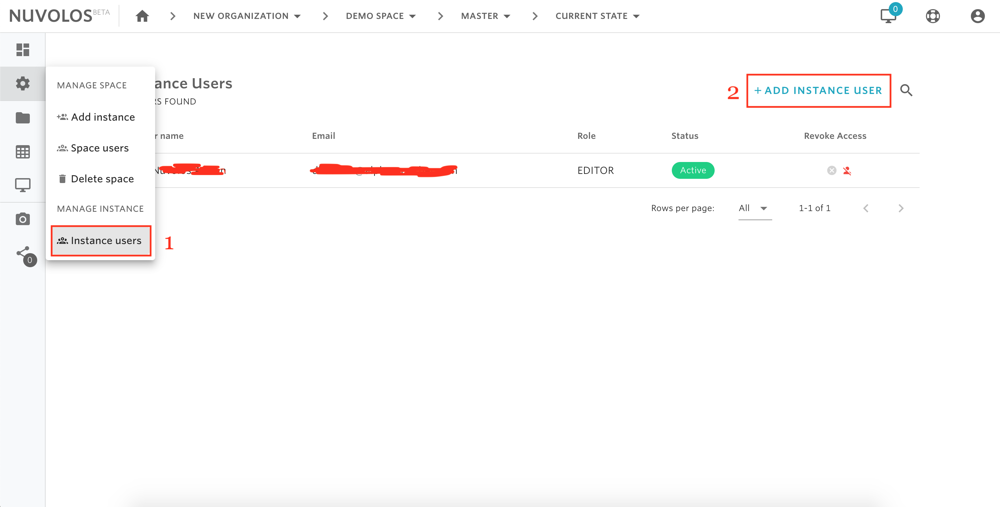
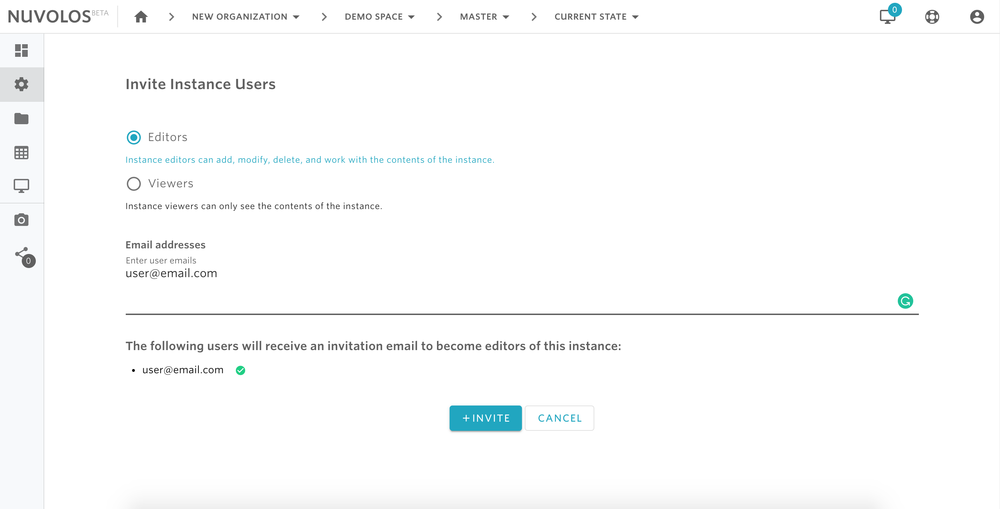

# Invite instance users


* At the instance level, there are two types of permission that can be granted: instance editor and instance viewer. For details on the types of rights each of these roles has, please read [here](../../data-organization/instances.md).
* Before granting access rights to an instance, make sure that the right permissions are set. Only space administrators are allowed to grant access right for an instance.


## **To invite a new instance user:**

1- From the toolbar breadcrumbs, select the space and instance you want to invite users to. For example, let's say that we are working in a the space "Demo Space" and we want to invite an instance editor to the Master instance of this space.

2- From the left sidebar, hover on the settings icon and click on "Instance users". After that, from the top right click on "ADD INSTANCE USER"

3- Select the type of invitation you want to send \(in our case Editor\).  

4- Provide the emails of the users you want to invite to the instance and finally click on INVITE.

#### If you are encountering a problem inviting instance users, refer to the troubleshooting guide here. 

