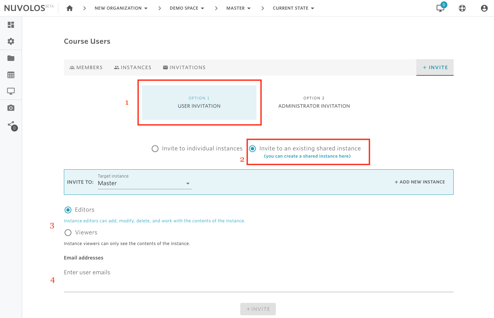

# Invite instance users


* Only space administrators are allowed to grant access right for an instance.


## **To invite a new instance user:**

1- Open a space \(using the breadcrumbs in the toolbar\).

2- From the overview screen, click on "Course Users" \(if education space\), "Project Users" \(research space\), or "Dataset Users". Assume we are in a class called Demo Space and we want to invite a user as an editor of the Master instance.

2- Using the tabs, navigate to INSTANCES.

3- Locate the instance you want to invite to and click on the 'Invite users' tile associated with it \(in our case it's the Master instance\).

3- Select Option1: User Invitation.

4- Click on the "Invite to an existing shared instance" radio button \(if you are in a research project or a dataset then this is the only available option\).

5- Select the role you want to assign to the new users. Two options are available: instance editor and instance viewer.

6- Provide a list of emails of the users to invite.

7- Finally, click on the INVITE button.

#### If you are encountering a problem inviting instance users, refer to the troubleshooting guide here. 

