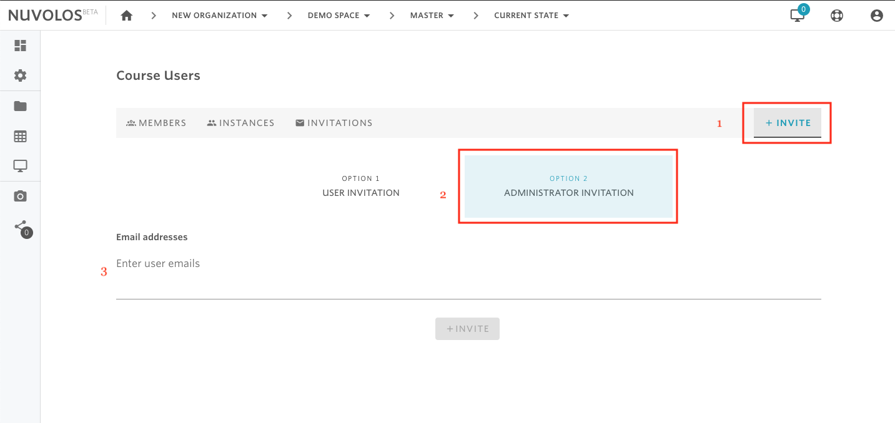

# Invite Space Administrators

## **To invite a space administrator:**

1- Open the space you want to invite an administrator to\(using the breadcrumbs in the toolbar\).

2- From the overview screen, click on "Course Users" \(if education space\), "Project Users" \(research space\), or "Dataset Users".

2- Using the tabs, navigate to INVITE.

3- Select Option 2: Administrator Invitation.

4- Provide the email\(s\) of the user\(s\) you want to invite.

5- Finally, click on the INVITE button.

#### If you are encountering a problem inviting instance users, refer to the troubleshooting guide here. 

