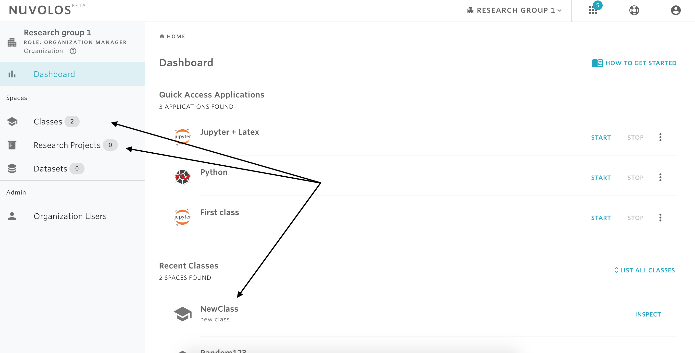
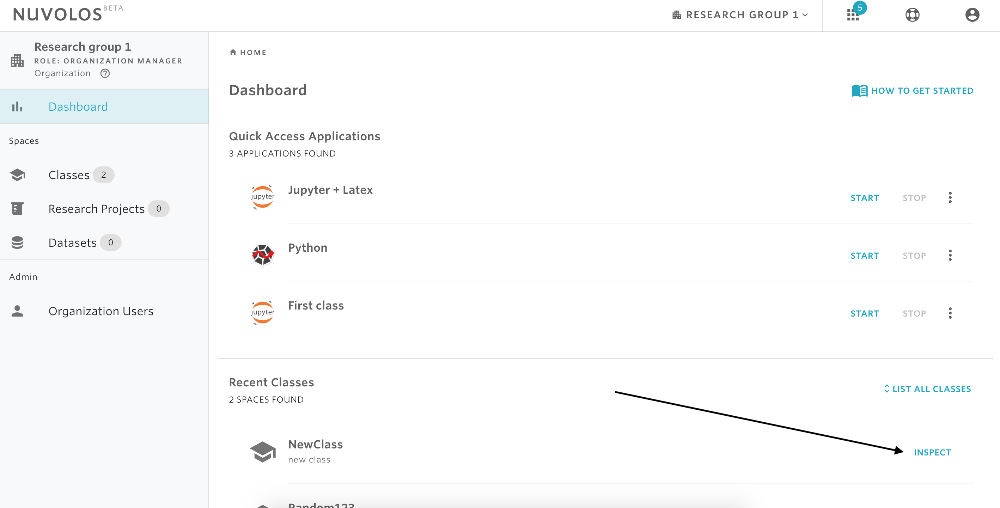
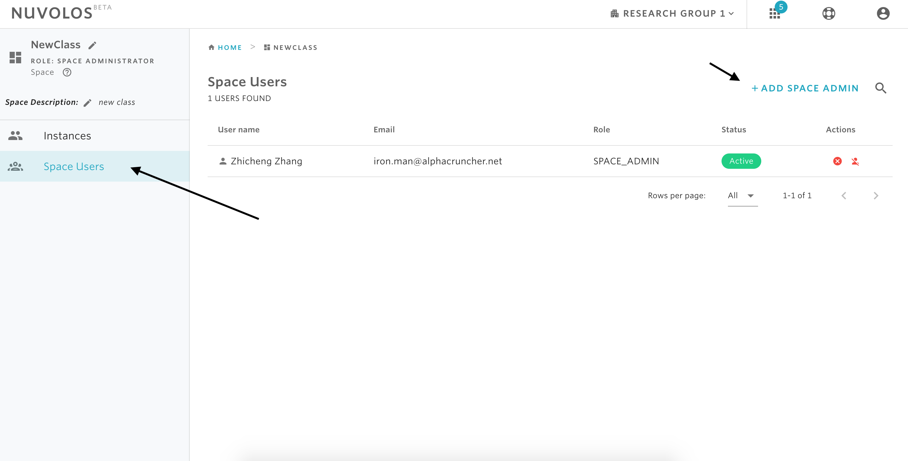
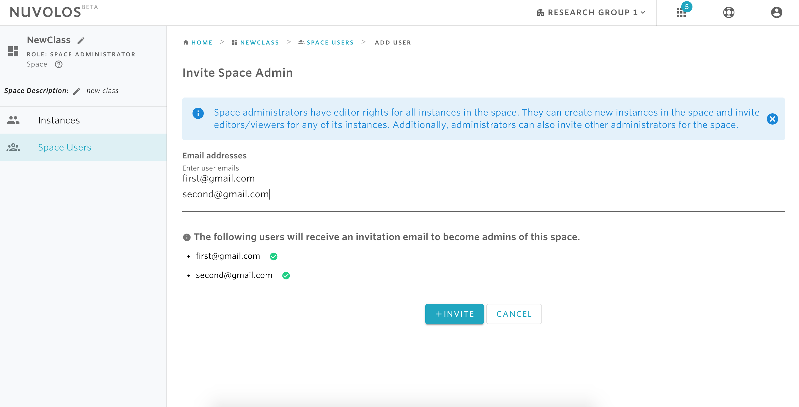

# Invite Space Administrators


At the space level, the only type of permission that can be granted is that of space admin. For details on the types of rights a space admin has, please read [here](../../data-organization/spaces.md).


## **To invite a space administrator:**

1. Identify the space you want to invite the user to. This can be done from the dashboard either from the recent spaces displayed or from the full list of spaces accessible from the left sidebar.

2- Click on INSPECT

3- From the left sidebar, click on **Space Users** and then on **ADD SPACE ADMIN**.

4- Enter the email address\(s\) of the people you want to invite and then click on **INVITE**.

