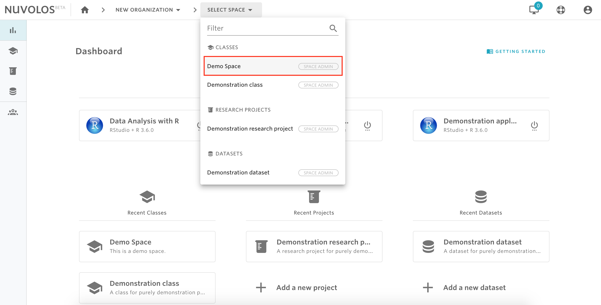
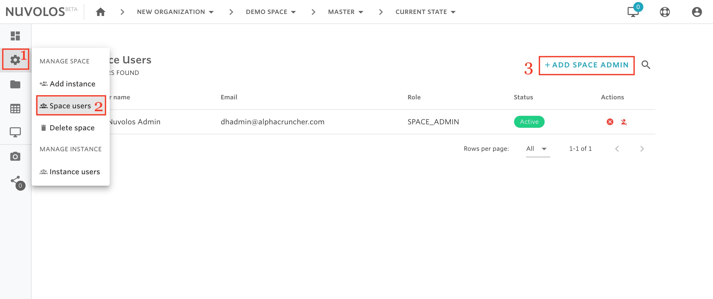
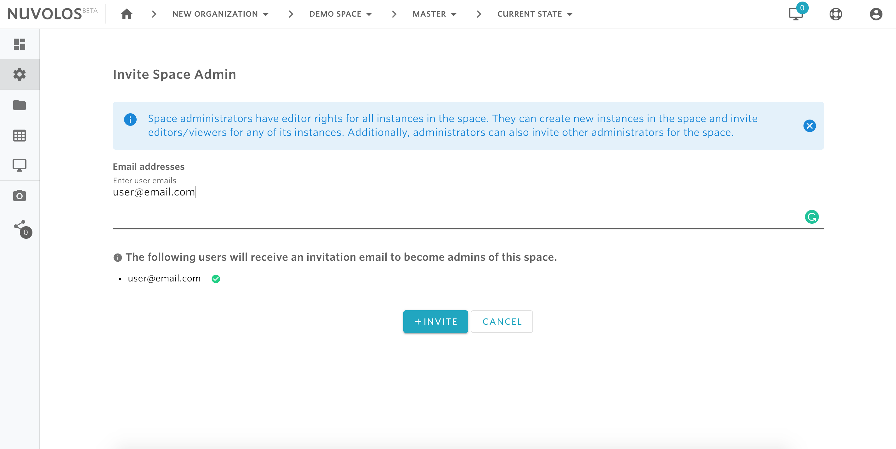

# Invite Space Administrators

## **To invite a space administrator:**

1- From the toolbar breadcrumbs, select the space to which you want to invite a space administrator. For example, let's say we want to invite an administrator for the space "Demo Space".

2- From the left sidebar, hover on the settings icon and click on "Space users". After that, from the top right click on "ADD SPACE ADMIN"

3- Provide the emails of the users you want to invite to the space and finally click on INVITE.

#### If you are encountering a problem inviting instance users, refer to the troubleshooting guide here. 

