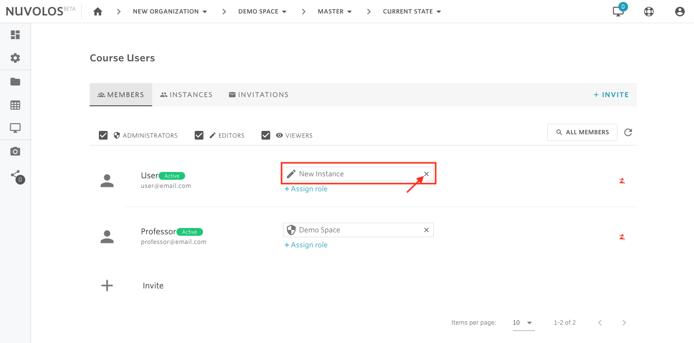
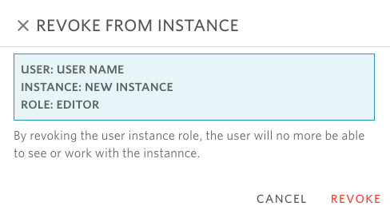

# Revoke instance users

## To revoke or an instance user:

1- Open the space where the user has an instance role.

2- From the overview screen, click on "Course Users" \(if education space\), "Project Users" \(research space\), or "Dataset Users".

3- Using the tabs, navigate to MEMBERS.

4- Identify the user to revoke the role from.

5- Locate the tile corresponding to the instance role of the user and click on the X button.

6- A dialog will open asking to confirm the operation.

7- Finally, click **REVOKE**.

