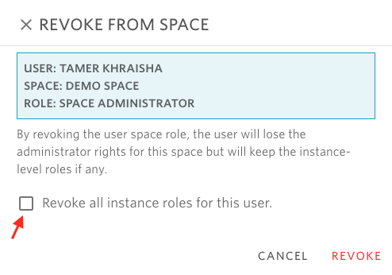

# Revoke space administrator role


A space administrator can revoke or deactivate space administrators.

* **Revoke** will simply revoke the space role from the user. User account and instances/snapshots are not deleted, only the affected users won't see them anymore.
* **Deactivate** blocks user login, so it's a user-global operation.


## To revoke or deactivate a space administrator:

1- Open the space you want to revoke the administrator role from \(using the breadcrumbs in the toolbar\).

2- From the overview screen, click on "Course Users" \(if education space\), "Project Users" \(research space\), or "Dataset Users".

3- Using the tabs, navigate to MEMBERS.

4- Identify the user to revoke the role from.

5- Locate the tile corresponding to the space administrator role of the user and click on the X button.

 

6- A dialog will open asking to confirm the operation. Note that it is possible to keep or revoke any other instance-level roles associated with the user. To revoke all instance-level roles, check the 'Revoke all instance roles for this user' box inside the revoke dialog.

7- Click confirm.

