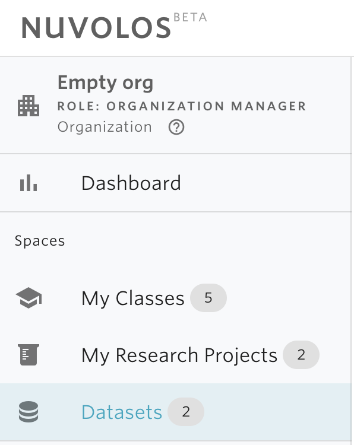
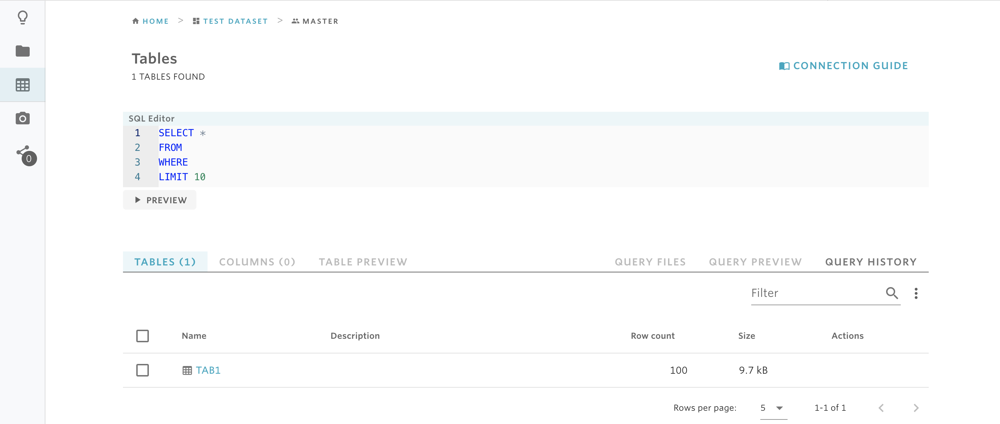
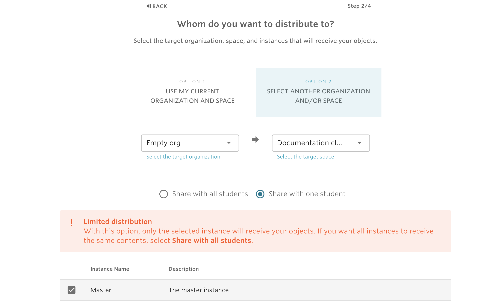

# Add data to your working instance

Adding data to your working instance in Nuvolos is a special case of [distribution](../distribute-objects-in-nuvolos/). We suggest reading the distribution guide first. In order to use distribution for the particular use case, follow these steps to get data to your working instance.

## Decide the target and the source

In the following example, we assume the working instance to be in the **Empty Org** organization and the **Documentation Class** space. This is the target of the distribution. The source is one of the two datasets currently available for the organization:

## Choose what you need and stage

We navigate into the dataset named **Test dataset** and to the Tables view of the **Current state**.

Here you can run a SQL query or preview the tables you currently have. We select the row for **TAB1** and the action **STAGE SELECTED** pops up similarly to what happened in the distribution guide. 

## Distribute

Once we've clicked **STAGE SELECTED** on the desired tables, we continue by distributing to our workspace in **Empty org - Documentation class.** In this particular use case, the Documentation class is set up as a class and we will distribute to the Master instance:

From here on, we just finalise distribution as usual.


Currently it is **not** possible for the stage to contain objects from multiple sources, so once you are done in a particular source, you will need to distribute before moving on to another!


