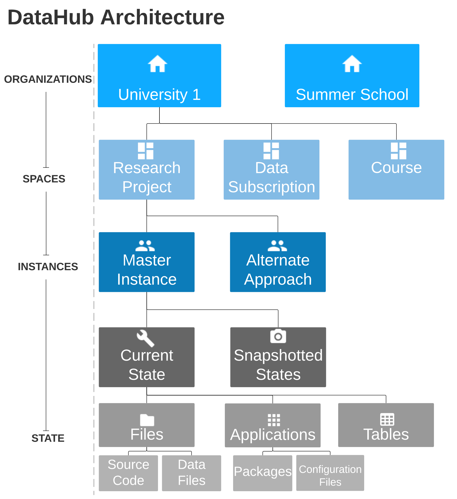

# Structure of Nuvolos

Most of the user work in Nuvolos happens in confined single- or multi-user environments called _spaces_. A space stores the files \(code and data files\), database tables, and applications related to a specific academic activity. 

Spaces are contained in _organizations._ An organization is a collection of spaces and serves essentially as an administrative unit, a cost center and a strong licensing barrier. For example, a summer school might be a separate organization: each class would be set up as a separate space, with common administration that operates on the organization level.

Spaces are a collection of _instances_. In particular an academic project might comprise of multiple people working on a related subject \(_in one space_\), however working independently \(_in separate instances_\), occasionally sharing their results \(via Nuvolos solutions that facilitate sharing work on a space level\). Instances are a way to maintain parallel versions \(branches\) of related material. In a single-user setup, a space will generally contain just one main instance - called the _master instance._

Instances are comprised of _states._ The _current state_ is the only mutable state of the instance, snapshot states are immutable and are Nuvolos' way of storing a safe version of an instance. States may include any or all of files, database tables and applications, depending on the use case.

