# Accessing table data from applications

Nuvolos is set up so you can access your data tables stored in Nuvolos from either in-Nuvolos applications or external, non-Nuvolos applications.

## Accessing data from applications running in Nuvolos

Currently, data access from Nuvolos is supported in the following applications: Python \(Spyder, JupyterLab and VS Code\), RStudio, Matlab and Stata.

### Accessing data tables from Python in Nuvolos

If you want to use Nuvolos-hosted Python \(via JupyterLab or Spyder\), the data access will be simple:

1. Make sure you have the data available.
2. **Run** your application.
3. Inside your app, you will need to use the `nuvolos-odbc` [Python library](https://github.com/nuvolos-cloud/python-connector) developed by Alphacruncher, which is pre-installed in the Jupyter application.

Usage example:

```python
from nuvolos import get_connection
import pandas as pd

con = get_connection()
df = pd.read_sql("SELECT * FROM table", con=con)
```

#### Stopping queries from Python

Please refer to the [Cancelling queries](./#cancelling-queries) section for the available SQL commands. You can execute them as

```sql
df = pd.read_sql("<SQL_COMMAND>", con=con)
```

### Accessing data tables from R in Nuvolos

If you want to use Nuvolos-hosted R \(via RStudio\), the data access will be simple:

1. Make sure you have the data available.
2. **Run** your application.
3. Inside RStudio, you will need to use the [r-connector](https://github.com/nuvolos-cloud/r-connector) developed by Alphacruncher.

Usage example:

```r
con <- nuvolos::get_connection()
result_data <- dbGetQuery(con,"SELECT * FROM table LIMIT 10")
```

#### Stopping queries from R

Please refer to the [Cancelling queries](./#cancelling-queries) section for the available SQL commands. You can execute them as

```sql
result_data <- dbGetQuery(con,"<SQL_COMMAND>")
```

### Accessing data tables from Stata in Nuvolos

If you want to use Nuvolos-hosted Stata, the data access is greatly simplified. Nuvolos has its own `sysprofile.do` that automatically sets you up with access parameters. Stata communicates with the database using `odbc` , so you will need to issue the following command to load the query:

```text
odbc load, exec(`"SELECT * FROM "table" LIMIT 10"') connectionstring($conn_str)
```

#### Stopping queries from Stata

Please refer to the [Cancelling queries](./#cancelling-queries) section for the available SQL commands. You can execute them as

```sql
odbc load, exec(`"<SQL_COMMAND>"') connectionstring($conn_str)
```

### Accessing data tables from Matlab in Nuvolos

First test your query in the Tables view of your space \(or create a new query by using our Querybuilder Form\). Then select the option **Run from application &gt; Matlab** when looking at the query results preview to see the instructions on executing the given query inside Matlab on Nuvolos.

We suggest using the `select` statement of Matlab as it provides results in the [table](https://www.mathworks.com/help/matlab/tables.html) data type. For example:

```text
conn = get_connection();
result_data = select(conn,'SELECT * FROM TABLE_NAME LIMIT 10');
```

In this example, `result_data` will be of the table type, and thus column names will be also available for the programmer as part of the return data structure.

## Accessing data tables from external, non-Nuvolos applications

### Connecting with R

First, please download and install the [Snowflake ODBC database driver](https://docs.snowflake.com/en/user-guide/odbc.html) for your platform, which is required to access the Nuvolos database service. You only need to satisfy the prerequisites and finish the ODBC driver installation \(first step\).  You don't need to further configure and test the driver. 

Once the ODBC driver is installed, please install the Nuvolos `r-connector` package developed for Nuvolos:

```r
install.packages("remotes")
remotes::install_github("nuvolos-cloud/r-connector")
```

Next,  [obtain access tokens](obtain-tokens-for-your-data.md) and database/schema names from the Connection Guide on the Nuvolos _Tables_ interface of the instance you wish to access:


Finally, pass the database name and schema name to the`get_connection()` function:

```r
con <- nuvolos::get_connection(dbname = '"my_database"', schemaname= '"my_schema"')
result_data <- dbGetQuery(con,"SELECT * FROM table LIMIT 10")
```

**Attention:** you need to follow the quotation approach as the example code, i.e., writing the database and schema names with double-quotation, and **adding the single quote outside of the double quote**.

**Credentials**: When you connect to the Nuvolos database for the first time, it will ask for your credentials. Check "Remember with keyring" box to avoid your future input. You can find your credentials following the [connection guide](https://app.gitbook.com/@alphacruncher-1/s/nuvolos/~/drafts/-MMuNtFnFrIaP3B5ov-M/data/access-data-from-applications/obtain-tokens-for-your-data/).  You don't need to write your credentials explicitly in your scripts, and the connector can safely access your token during the connection process.

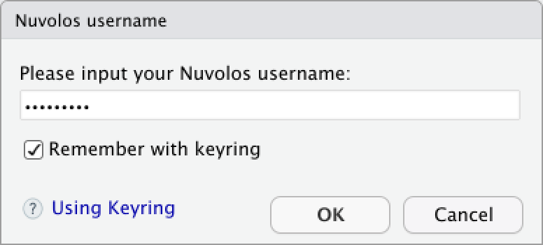

In case you need to re-input your credentials, please execute the command below in R's console.

```sql
nuvolos::input_nuvolos_credential()
```

#### Stopping queries from R

Please refer to the [Cancelling queries](./#cancelling-queries) section for the available SQL commands. You can execute them as

```sql
result_data <- dbGetQuery(con,"<SQL_COMMAND>")
```

### Connecting with Python 

First, install the `nuvolos` package developed for Nuvolos:

```bash
pip install --upgrade nuvolos
```


Since version 0.4.0 of the `nuvolos` package, installing the ODBC driver is no longer required.


Next,  [obtain access tokens](obtain-tokens-for-your-data.md) and database/schema names from the Connection Guide on the Nuvolos _Tables_ interface of the instance you wish to access:


Finally, pass the database and schema names specified in the [Connection Guide](https://app.gitbook.com/@alphacruncher-1/s/nuvolos/~/drafts/-MMuNtFnFrIaP3B5ov-M/data/access-data-from-applications/obtain-tokens-for-your-data/) to the `get_connection()` function:

```python
from nuvolos import get_connection
import pandas as pd

con = get_connection(dbname = "dbname", schemaname="schemaname")
df = pd.read_sql("SELECT * FROM table", con=con)
```

**Credentials**: When you connect to the Nuvolos database for the first time, it will ask for your credentials. You can find your credentials following the [connection guide](https://app.gitbook.com/@alphacruncher-1/s/nuvolos/~/drafts/-MMuNtFnFrIaP3B5ov-M/data/access-data-from-applications/obtain-tokens-for-your-data/).  You don't need to write your credentials explicitly in your scripts, and the connector can safely access your token during the connection process.

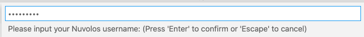

This will trigger the request to access your credential if it is the first time to access the Nuvolos database.  Please input your local computer's password to allow the Python connector to read your Nuvolos credential.

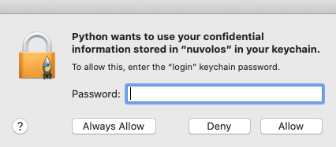

In case you need to re-input your credentials, please execute the command below in Python's console.

```sql
from nuvolos import input_nuvolos_credential
input_nuvolos_credential()
```

#### Stopping queries from Python

Please refer to the [Cancelling queries](./#cancelling-queries) section for the available SQL commands. You can execute them as

```sql
df = pd.read_sql("<SQL_COMMAND>", con=con)
```

#### Special Notes for Win10

If you meet the error below:

```sql
RuntimeError: The current Numpy installation (...) fails to pass a sanity check due to a bug in the windows runtime...
```

Please install an older version of NumPy from a terminal to solve this.  It is a temporary solution specifically for windows 10.

```sql
pip install numpy==1.19.3
```

### Connecting with Stata

Accessing data from out-of-Nuvolos Stata applications consists of the following steps:

1. Install[ the Snowflake ODBC driver](setting-up-odbc-drivers.md).
2. [Obtain access tokens](obtain-tokens-for-your-data.md) and database/schema names from the Connection Guide on the Nuvolos tables interface.
3. Establish a connection.


To simplify work, we suggest that you save your connection parameters to global macros and finally create a connection string as a global macro. On Nuvolos, this is part of the sysprofile.do file of the application. 

You should only add these macros to your profile.do or sysprofile.do if you are going to work only in one single instance and state/snapshot.


To set up your access parameters, issue the following commands. These have to be issued only once. The values for `username` and `snowflake_access_token` can be obtained [following these instructions](obtain-tokens-for-your-data.md), and for `database_name` and `schema_name`, [follow instructions here](find-your-database-and-schema-path.md).

```text
set odbcmgr unixodbc
global user "<username>"
global dbpwd "<snowflake_access_token>"
global dbpath_db `"<database_name>"'
global dbpath_schema `"<schema_name>"'
global conn_str `"DRIVER=SnowflakeDSIIDriver;SERVER=alphacruncher.eu-central-1.snowflakecomputing.com;DATABASE=$dbpath_db;SCHEMA=$dbpath_schema;UID=$user;PWD=$dbpwd"'
```

You can then access data similar to if you were using Nuvolos:

```text
odbc load, exec(`"SELECT * FROM "table" LIMIT 10"') connectionstring($conn_str)
```

#### Stopping queries from Stata

Please refer to the [Cancelling queries](./#cancelling-queries) section for the available SQL commands. You can execute them as

```sql
odbc load, exec(`"<SQL_COMMAND>"') connectionstring($conn_str)
```

### Connecting with SAS

Accessing data from out-of-Nuvolos SAS applications consists of the following steps:

1. Install[ the Snowflake ODBC driver](setting-up-odbc-drivers.md).
2. [Obtain access tokens](obtain-tokens-for-your-data.md) and database/schema names from the Connection Guide on the Nuvolos tables interface.
3. Establish a connection.

In SAS we suggest creating a library of the contents of your instance. To do this, we suggest posing the following statement to SAS:

```text
libname NUVOLOS odbc complete="DRIVER={SnowflakeDSIIDriver};
SERVER=alphacruncher.eu-central-1.snowflakecomputing.com;
UID=<USER NAME>;
PWD=<PASSWORD>" qualifier="<DATABASE NAME>" schema="<SCHEMA NAME>" 
dbcommit=200000 autocommit=no preserve_col_names=yes preserve_tab_names=yes
readbuff=32000 insertbuff=32000;
```

In the above example `<USER NAME>, <PASSWORD>` can be learned from [obtaining your tokens](obtain-tokens-for-your-data.md), and `<DATABASE NAME>, <SCHEMA NAME>` can be learned by [finding your database and schema path](find-your-database-and-schema-path.md).

#### Running a query from a query file with SAS

Assuming you have composed an SQL query that you would like to run in SAS, and saved it in the file `source/to/file.sql`. The following code puts the SQL statement in the file to a macro named  `sqlcode` in SAS:

```text
data _null_;
infile 'source/to/file.sql' recfm=f lrecl=32767 pad;
input @1 sqlcode $32767.;
call symputx('sqlcode', sqlcode);
put sqlcode=;
run;
```

The following statement executes the above query:

```text
proc sql;
	connect using NUVOLOS;
	select * from connection to NUVOLOS(
		USE SCHEMA "<DATABASE NAME>"."<SCHEMA NAME>";
	);
	create table test as select * from connection to NUVOLOS(
		&sqlcode
	);
quit;
```

To analyze the above SAS statement, notice the following:

1. We are using the SAS SQL Procedure Pass-Through Facility twice.
2. The first statement makes sure that SAS connects to the correct database and schema. We strongly suggest using this statement first whenever you are using the Pass-Through Facility.
3. The second statement creates a table called `test` based on the code that is in the file `source/to/file.sql.`

### Connecting with MATLAB

First, please download and install the [`nuvolos`](https://ch.mathworks.com/matlabcentral/fileexchange/82903-nuvolos?s_tid=srchtitle) toolbox developed for Nuvolos.  You can also click "Get Add-ons", search "nuvolos" in the MATLAB Add-on Explorer, and then “Add" in your toolbox. 

Next,  [obtain access tokens](obtain-tokens-for-your-data.md) and database/schema names from the Connection Guide on the Nuvolos _Tables_ interface of the instance you wish to access:


Finally, pass the database and schema names specified in the [Connection Guide](https://app.gitbook.com/@alphacruncher-1/s/nuvolos/~/drafts/-MMuNtFnFrIaP3B5ov-M/data/access-data-from-applications/obtain-tokens-for-your-data/) to the `get_connection()` function:

```python
con = get_connection("dbname", "schemaname");
dataset = executeQuery(con,"SELECT * FROM my_table");
```

For your credential's safety consideration, the MATLAB connector will display the login dialog for the first time connecting to the Nuvolos database.  Please find your credentials following the [Connection Guide](https://app.gitbook.com/@alphacruncher-1/s/nuvolos/~/drafts/-MMuNtFnFrIaP3B5ov-M/data/access-data-from-applications/obtain-tokens-for-your-data/).  

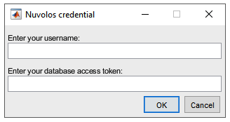

If you need to correct or change your credential, you can use the command below to input your credentials again.

```sql
create_credential(true)
```

### Connecting with Excel

For both Windows and Mac OS, please first install the [Snowflake ODBC database driver](https://docs.snowflake.com/en/user-guide/odbc.html) for your platform, which is required to access the Nuvolos database service. You only need to satisfy the prerequisites and finish the ODBC driver installation \(first step\).  You don't need to further configure and test the driver. 

#### Windows

1. After installation of ODBC driver, please download the "[Excelerator](https://github.com/Snowflake-Labs/Excelerator)" package to local and unzip it into a local folder.

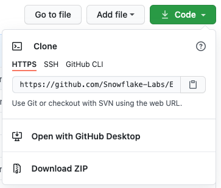

2. In the Windows File Explorer, navigate to the download location and right-click the`SnowflakeExcelAddin.xlam`   file, click Properties, and tick "Unblock":

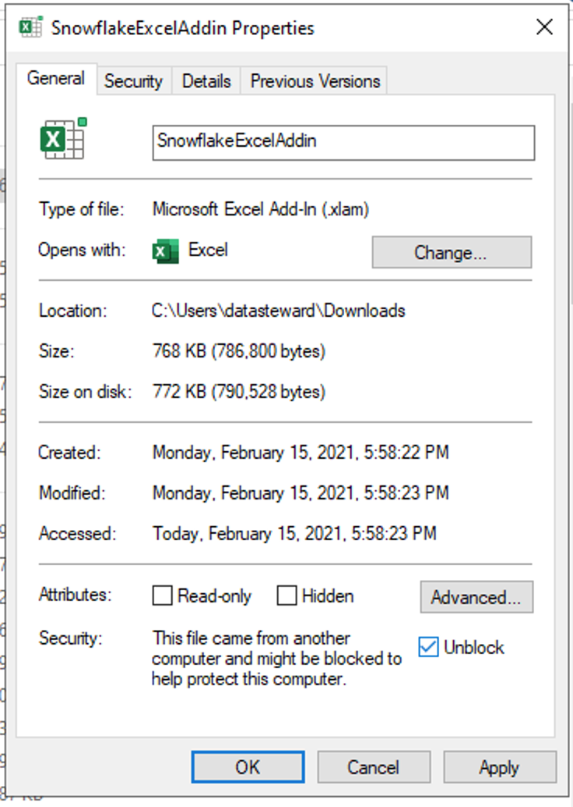

3. Open Excel. The add-in needs to be installed before it can be used:  

* Navigate to the add-in management window following "File"$$\Rightarrow$$"Option"$$\Rightarrow$$"Add-ins"$$\Rightarrow$$ "Go...".   
* Click the "Browse" button and navigate to the folder with the unzipped "Excelerator" package.
* Choose the file `SnowflakeExcelAddin.xlam` file, click "OK"

For more detailed Excel add-in installation and management, please refer to this [guide](https://exceloffthegrid.com/install-uninstall-excel-add/).

4. You can find the installed "Excelerator" add-in on the Home tab of the Ribbon.

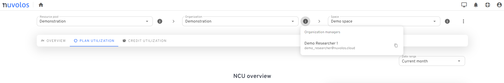

5. Click the "connect" button to open the connection window:  

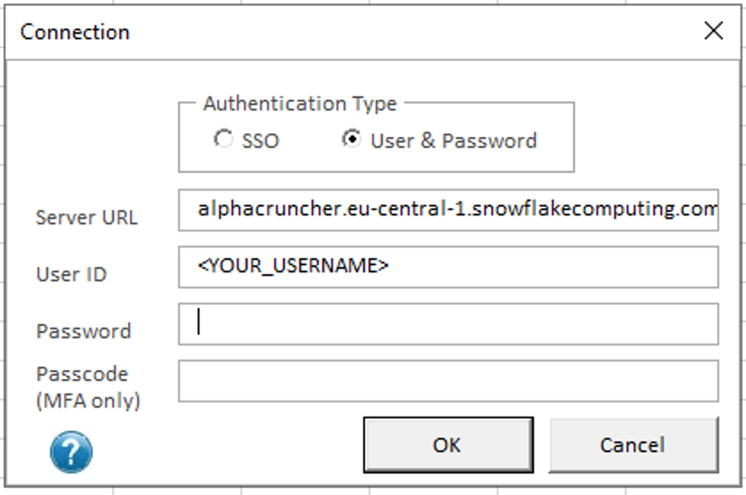

6. Under the "User & Password" authentication type, please enter the appropriate values "server URL", "User ID" and "Password" to login. You can find the required[ access tokens](obtain-tokens-for-your-data.md) and database/schema names from the Connection Guide on the "Tables" ****page of your Nuvolos space.  **Note**: "Hostname" is the "server URL".

7. Click the "Query" button in the add-in.  It shows the SQL execution window to query data.  Please select the target "Database", "Schema" first, then the add-in will load all the available tables in "Table".  The default is to query all columns unless the user click "Choose" to select a few target columns only.  After entering the SQL command in the window below and clicking "Execute", the results will be inserted as a table to the active Excel sheet.

**Attention**: the SQL command must quote the table as the way of "database-name"."schema-name"."table-name".


#### Uploading Data

Table data can be updated or a new table can be created with sheet data using the Excelator add-in.

To upload data to Nuvolos, please perform the following steps:

1. Click on the cell of the first row and the first column of the data you wish to upload.
2. Click "Define Data Types" on the Home ribbon. This will add a row above the first row, where you will need to select the appropriate data types for the data columns you wish to upload. Unfortunately, the Add-In cannot automatically infer the data types for the columns: 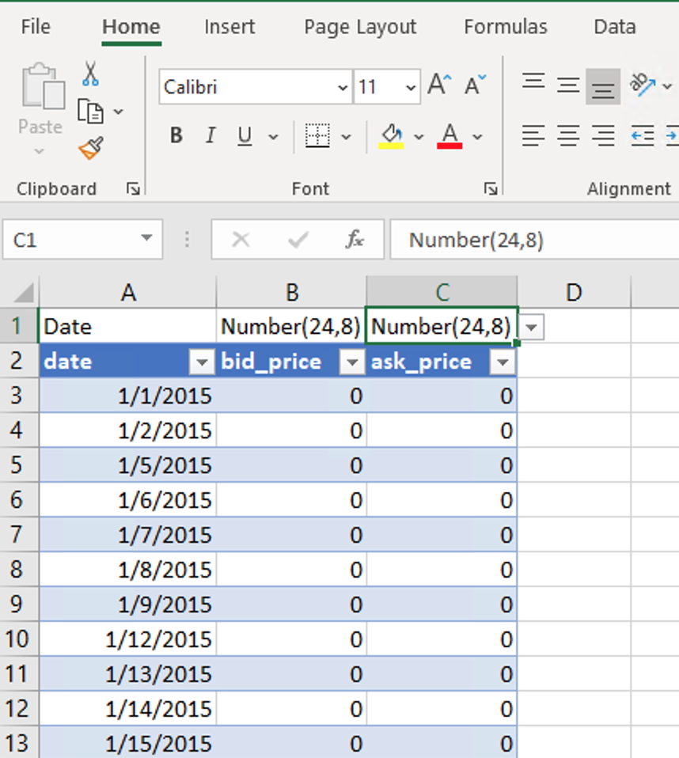 

3. Once you have the data types selected, click "Upload": 

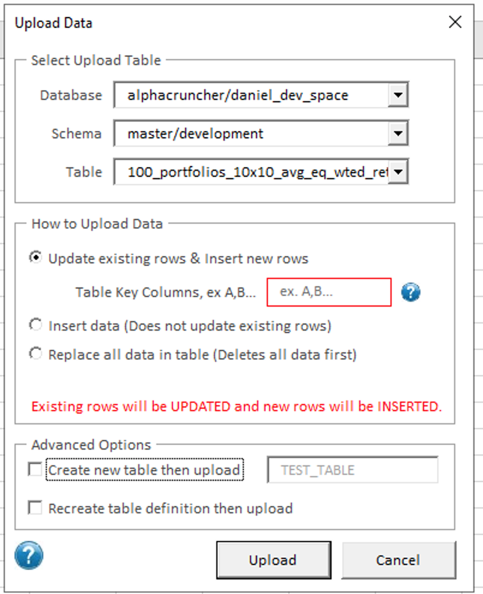 

4. Select the upload action to be taken: An existing table can be updated, appended to, or replaced with the data in the sheet. Alternatively, you can tick "Create new table then upload", then enter the name of the new table. Click "Upload" to upload your data.

#### Mac OS

1. After installation of the ODBC driver, please open a terminal and use the command below to copy all the folders and files created from downloading the Snowflake ODBC driver \(typically the **`/opt/snowflake/`** path**\)** to the **`/Library/ODBC/ODBCDataSources`** folder:

   ```text
   ~$ sudo cp -r /opt/snowflake/ /Library/ODBC/ODBCDataSources
   ```

2. The user has to manually update the Snowflake ODBC Driver's file at  **`/Library/ODBC/ODBCDataSources/snowflakeodbc/lib/universal/simba.snowflake.ini`.**  After navigate and open this file, please change two lines below in the file to remap the new locations of its associated files: 

```text
ErrorMessagesPath = /Library/ODBC/ODBCDataSources/snowflakeodbc/ErrorMessages
CABundleFile = /Library/ODBC/ODBCDataSources/snowflakeodbc/lib/universal/cacert.pem
```

After the changes, the file should look like below, and please save the file.

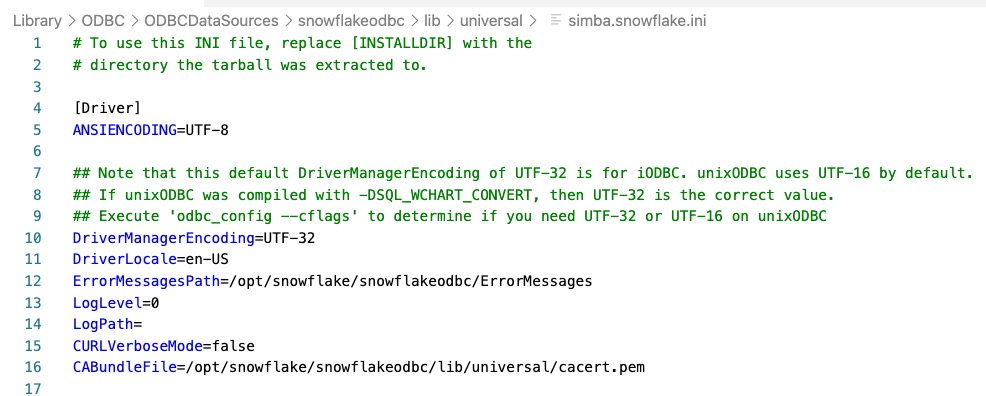

3. Run the command below to open the application with **administrator** rights, otherwise, it will show "General installer error" in the later stage.

```sql
sudo /Applications/iODBC/iODBC\ Administrator64.app/Contents/MacOS/iODBC\ Administrator64
```

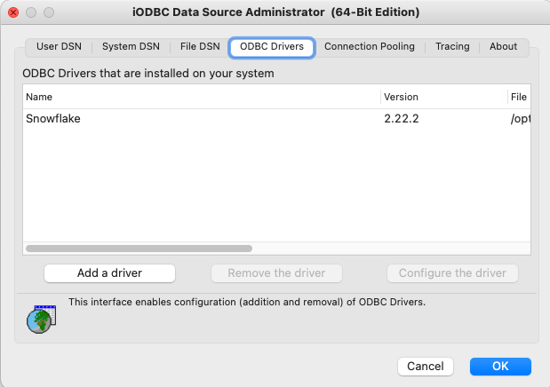

4. Click on the **ODBC Drivers** tab, and check if the Snowflake driver is already present. If it is, verify that the file path is  **`/Library/ODBC/ODBCDataSources/snowflakeodbc/lib/universal/Snowflake.dylib`**. If it is not, click **Add a driver**.

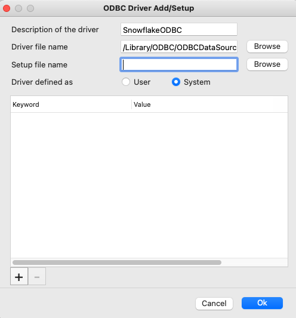

* In the field **Description of the driver**, type a name for the driver, such as "SnowflakeODBC".
* In the field **Driver file name**, click **Browse** and navigate to the driver file **`libSnowflake.dylib`** in the **`/Library/ODBC/ODBCDataSources/snowflakeodbc/lib/universal/`** folder.
* Click **Ok**.
* Under the **System DSN** tab, click **Add**. A dialog opens.
* Select the Snowflake driver you added. The DSN configuration window opens.

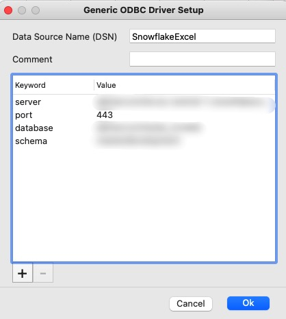

* Enter a unique DSN name for your Snowflake connection, such as "SnowflakeExcel".
* In the keyword section, click the "+" button at the left bottom to add keyword and value pairs of "server", "port", "database" and "schema". The user can [obtain these values and access tokens](obtain-tokens-for-your-data.md) from the Connection Guide on the interface of the Nuvolos "Tables". 
* Click **OK** to save settings. 

 5.  Launch Microsoft Excel.  Go to **Data** &gt; **New Database Query** &gt; **From Database**.

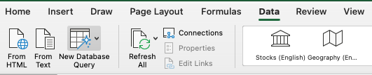

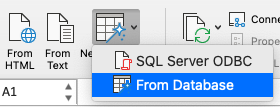

6. With the **iODBC Data Source Chooser** window open, switch to the **System DSN** tab and select the DSN created, and hit **OK**.

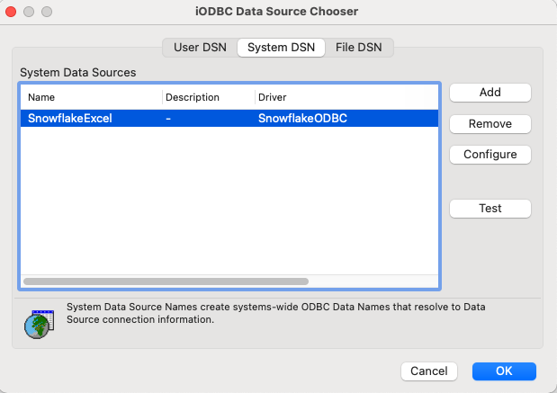

7. Enter your Snowflake username and password.  The user can [obtain access tokens](obtain-tokens-for-your-data.md) from the Connection Guide on the interface of the Nuvolos "Tables". 

8. The **Microsoft Query** window opens.

* Type the desired SQL statement, and click **Run**.
* Click **Return Data** to import the results to the spreadsheet.
* **Attention**: the SQL command must quote the table as the way of "database-name"."schema-name"."table-name".
* The user can [obtain the database, schema, and table names](obtain-tokens-for-your-data.md) from the Connection Guide on the interface of the Nuvolos "Tables". 

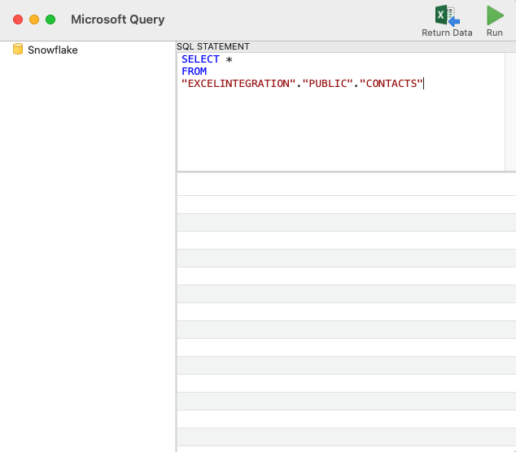

## Canceling queries

Running queries can be listed and \(selectively\) canceled using SQL statements.

### List running queries

You can check how many running queries you have with the command below. You'll need to substitute your Nuvolos username into the &lt;USERNAME&gt; placeholder. You can find out your Nuvolos username in the Profile page on the Nuvolos Web interface.

```sql
SELECT USER_NAME, QUERY_ID, SESSION_ID, QUERY_TEXT, START_TIME FROM TABLE(INFORMATION_SCHEMA.QUERY_HISTORY_BY_USER(USER_NAME=>'<USERNAME>')) WHERE EXECUTION_STATUS = 'RUNNING'
```

### Cancel a particular query

Once you know the query id, you can cancel a specific query with

```sql
SELECT SYSTEM$CANCEL_QUERY('<QUERY_ID>')
```

### Cancel all running queries

Alternatively, you can cancel all your currently running queries with the command

```sql
ALTER USER <USERNAME> ABORT ALL QUERIES
```


## Exporting big data

If your work requires frequently reading a large amount of tabular data from Nuvolos tables, in cluster batch jobs, for example, or you wish to export the result of a query that exceeds 1 million rows, it is recommended to retrieve the data locally as [Parquet](https://databricks.com/glossary/what-is-parquet) compressed data files.

Parquet files offer high data compression and significantly faster read times compared to CSV files and are supported by most scientific applications \(Matlab, Pandas, R\).

### Export steps

The general steps that need to be performed are the following:

1. Create a staging area in the database where the database engine will export the query results as a Parquet file,
2. Run the query and export the data,
3. Retrieve the exported data from the staging area in the database,
4. Drop the remote staging area.

This translates to the following SQL, assuming the compressed data will be less, than 5GB:

```sql
CREATE OR REPLACE FILE FORMAT PARQUET_FORMAT TYPE = PARQUET COMPRESSION = SNAPPY;
CREATE OR REPLACE STAGE PARQUET_STAGE FILE_FORMAT=PARQUET_FORMAT;

COPY INTO @PARQUET_STAGE/orders.parquet
FROM (SELECT * FROM ORDERS)
HEADER = TRUE
OVERWRITE = TRUE
SINGLE = TRUE
MAX_FILE_SIZE = 5000000000;


GET @PARQUET_STAGE file:///files/query_results/ PATTERN='orders.parquet' PARALLEL=4;

DROP STAGE PARQUET_STAGE;
DROP FILE FORMAT PARQUET_FORMAT;
```

If you anticipate that the result set of your query would be larger than 5GB compressed \(~50M rows\), you will need to split the exported data into multiple Parquet files. This way the export will be faster, however, as the database engine can parallelize the data export:

```sql
CREATE OR REPLACE FILE FORMAT PARQUET_FORMAT TYPE = PARQUET COMPRESSION = SNAPPY;
CREATE OR REPLACE STAGE PARQUET_STAGE FILE_FORMAT=PARQUET_FORMAT;

COPY INTO @PARQUET_STAGE/orders_
FROM (SELECT * FROM ORDERS)
HEADER = TRUE
OVERWRITE = TRUE
SINGLE = FALSE
MAX_FILE_SIZE = 5000000000;


GET @PARQUET_STAGE file:///files/query_results/ PATTERN='orders_*' PARALLEL=4;

DROP STAGE PARQUET_STAGE;
DROP FILE FORMAT PARQUET_FORMAT;
```

### Matlab example

You can download data as Parquet files and read them with Matlab as the following example demonstrates, which retrieves and loads the ORDERS table containing 15 million records:

```text
conn = get_connection();
execute(conn, 'CREATE OR REPLACE FILE FORMAT PARQUET_FORMAT TYPE = PARQUET COMPRESSION = SNAPPY;');
execute(conn, 'CREATE OR REPLACE STAGE PARQUET_STAGE FILE_FORMAT=PARQUET_FORMAT;');
execute(conn, sprintf([ ... 
'COPY INTO @PARQUET_STAGE/orders.parquet '...
'FROM (SELECT * FROM ORDERS) '...
'HEADER = TRUE '...
'OVERWRITE = TRUE '...
'SINGLE = TRUE '...
'MAX_FILE_SIZE = 5000000000; '...
]));


try
    % This line will fail with an error currently, however, the file will be retrieved.
    execute(conn, 'GET @PARQUET_STAGE/orders.parquet file:///files/query_results/ PARALLEL=4 ;');
catch
    warning('Data has been retrieved');
end

% Please run these clean-up statements after the error.
execute(conn, 'DROP STAGE PARQUET_STAGE;');
execute(conn, 'DROP FILE FORMAT PARQUET_FORMAT;');

info = parquetinfo('/files/query_results/orders.parquet')
T = parquetread('/files/query_results/orders.parquet')
```

