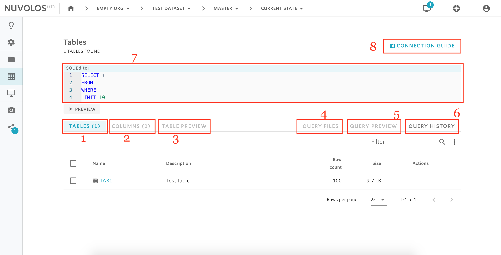
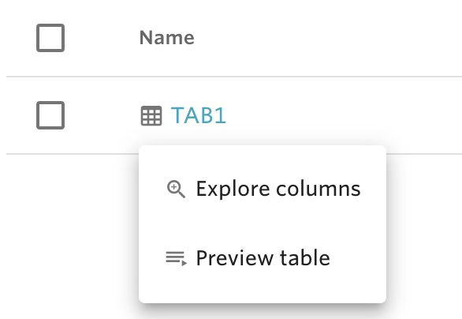
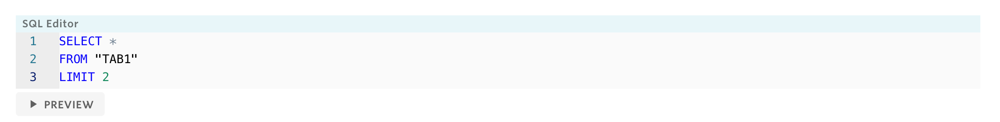

# The table view

The table view can be found in the sidebar once you are viewing work in a state. This sections details the functionality accessible from this view.

## Overview

The functionalities as a list:

1. Tables list
2. Columns list can be activated if you click on the table name.
3. Table preview can be activated if you click on the table name.
4. Query files - results of previous queries.
5. Query preview - preview the results of a complex query before you run a complete version
6. Query history - recall previous queries
7. SQL Editor - create your own SQL statements here
8. Connection guide - for application users

## Tables list

The tables list is the list of tables in the currently selected snapshot or current state. 

It is possible to stage, delete, rename and describe tables - hovering over a line will reveal the possible actions.

## Columns list and table preview

In order to see the columns list, click the table name and select **Explore columns.** Similarly, select **Preview table** to look at the first ten rows of the table.

In order to guide documentation it is also possible to give description to columns in the **Explore columns** view.

## Running queries

It is possible to run queries directly from the web interface.

1- Design your SQL query in the query editor. Once you are done, click **PREVIEW**.

2- Review the results. If what you see makes sense, you can proceed to run the entire query by clicking **SAVE FULL RESULTS** on the query preview:

      3. You will then be taken to the **QUERY HISTORY** page, where you can see queries that have                been run previously. You can also click on the folder icon next to your query to look at the complete query result. Results are stored compressed.

## Connection guide

Clicking the connection guide gives you information on access credentials to the database behind you particular workspace. You can find more about connecting via applications in this guide.

