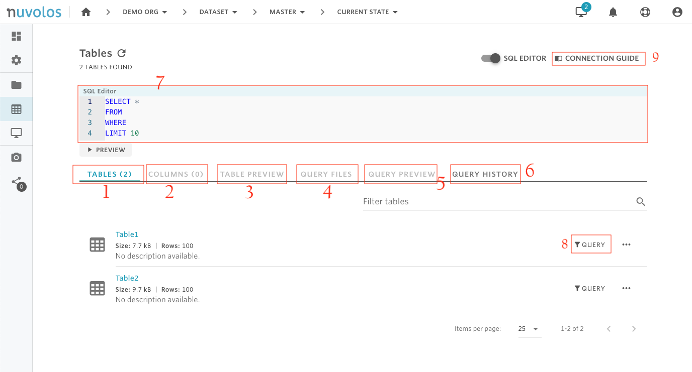

# The Tables view

The Tables view can be found in the sidebar once you are viewing work in a state.  You can view the data tables available in the active instance and run SELECT queries on the tables. This section details the functionality accessible from this view.

## Overview

The functionalities as a list:

1. Tables list
2. Column list can be activated if you click on the table name.
3. Table preview can be activated if you click on the table name.
4. Query files - results of previous queries.
5. Query preview - preview the results of a complex query before you run a complete version
6. Query history - recall previous queries
7. SQL Editor - create your own SQL statements here
8. Query builder - build your SQL statement using a user-friendly UI
9. Connection guide - for application users

## Tables list

The tables list is the list of tables in the currently selected snapshot or current state. 

It is possible to stage, delete, rename, and describe tables - hovering over a line will reveal the possible actions.

## Column list and table preview

In order to see the columns list, click the table name, and select **Explore columns.** Similarly, select **Preview table** to look at the first ten rows of the table.

In order to guide documentation, it is also possible to give a description to columns in the **Explore columns** view.

## Running queries

It is possible to run queries directly from the web interface. Currently, only SELECT queries are allowed. For the complete syntax of such a construct, please refer to the [database system documentation](https://docs.snowflake.com/en/sql-reference/constructs.html).

### Design your SQL query via the query builder or in the query editor

* To query data using the query builder \(this is recommended if you need data from a single table and you are not very familiar with SQL\), you first need to open it via the QUERY button and then follow the steps where you can select columns, add filters, number of rows, and finally click on "SUBMIT QUERY PREVIEW"

* Alternatively from the SQL editor \(click on the toggle to reveal\), you can directly type in your query and then click on PREVIEW. This can be useful if you need complex queries or combine data from different tables

### Review the results

If what you see makes sense, you can proceed to run the full query from an application or to save the full results of the query \(export\).

#### Run from application

If you click on the "Run From Application" button, you will be given an option to select which application to run the query from. Selecting the appropriate application will provide you with instructions how to run the query either on Nuvolos or on your local machine.


If you will repeatedly access the same data, we recommend to export the results instead of running it each time from the application. For programmatic access \(i.e. iterating through dates, etc..\) running from an application can be easier. However in all cases data that will be reused is recommended to be saved either to disc or to a new table.


#### Export results

If you want to run the entire query by clicking **SAVE FULL RESULTS** on the query preview:

You will then be taken to the **QUERY HISTORY** page, where you can see queries that have been run previously. You can also click on the folder icon next to your query to look at the complete query result. Results are stored compressed.

## Connection guide

Clicking the connection guide gives you information on access credentials to the database behind your particular workspace. You can find more about connecting via applications in this guide.

