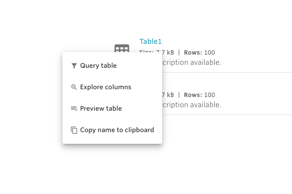
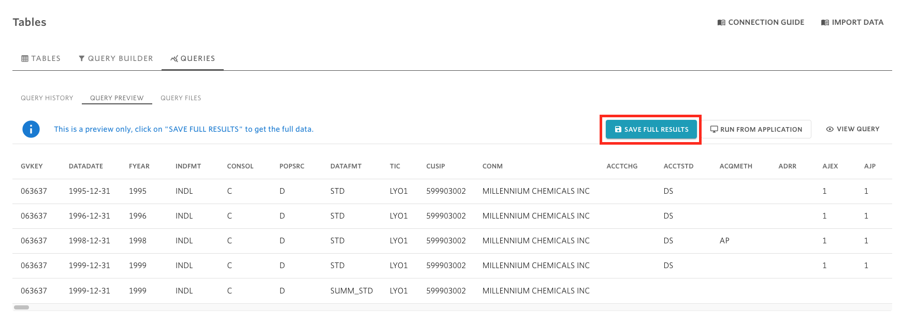

# The Tables view

The Tables view can be found in the sidebar once you are viewing work in a state.  You can view the data tables available in the active instance and run SELECT queries on the tables. This section details the functionality accessible from this view.

## Activating tables


Tables can only be activated by [Space Administrators](../../settings-and-administration/space-management/) and only if your organization has tables enabled. If you are not a space administrator but you need to work with tables, please bring up the issue with your space and organization administrator(s).


In order for you to be able to work with tables, make sure you have tables enabled. To enable tables navigate to the Tables view and click on the Activate Tables button. The process might take a few minutes. Once it completes, you will have a fully featured interface you can interact with.


If you have running applications and you activated the tables during the session, please make sure to restart your applications in the instance so your database credentials and information can be appropriately loaded.&#x20;


## Overview

.png>)

The functionalities as a list:

1. Tables and columns.
2. The query builder: build your SQL statement using a user-friendly UI.
3. The query history.
4. Tables list.
5. Tables columns: can be viewed by clicking on the table name.
6. Table preview: can be viewed by clicking on the table name.
7. Query table using the query builder.
8. SQL Editor - create your own SQL statements here.
9. Connection guide - for application users.

## Tables list

The tables list is the list of tables in the currently selected snapshot or current state.&#x20;

It is possible to stage, delete, rename, and describe tables - hovering over a line will reveal the possible actions.

## Column list and table preview

In order to see the columns list, click the table name, and select **Explore columns.** Similarly, select **Preview table** to look at the first ten rows of the table.

In order to guide documentation, it is also possible to give a description to columns in the **Explore columns** view.

## Running queries

It is possible to run queries directly from the web interface. Currently, only SELECT queries are allowed. For the complete syntax of such a construct, please refer to the [database system documentation](https://docs.snowflake.com/en/sql-reference/constructs.html).

### Design your SQL query via the query builder or in the query editor

* To query data using the query builder (this is recommended if you need data from a single table and you are not very familiar with SQL). Check the query builder page [here](the-query-builder.md) for more details.\

* Alternatively from the SQL editor (click on the toggle to reveal), you can directly type in your query and then click on PREVIEW. This can be useful if you need complex queries or combine data from different tables

### Review the results

If what you see makes sense, you can proceed to run the full query from an application or to save the full results of the query (export).

#### Run from application

If you click on the "Run From Application" button, you will be given an option to select which application to run the query from. Selecting the appropriate application will provide you with instructions on how to run the query either on Nuvolos or on your local machine.


If you will repeatedly access the same data, we recommend exporting the results instead of running it each time from the application. For programmatic access (i.e. iterating through dates, etc..) running from an application can be easier. However, in all cases data that will be reused is recommended to be saved either to disc or to a new table.

See [Exporting big data](https://docs.nuvolos.cloud/data/access-data-from-applications#exporting-big-data) for instructions.


#### Export results

If you run a query with Preview mode (e.g. using the SQL editor) and you want to get the full results of the query then you can use the SAVE FULL RESULTS option.

#### Extracting results

Compressed files are stored with the `.gz` extension, which is a short-hand for `gzip`.&#x20;

On MacOS and Linux to extract a `gzip` files you can use the `gzip` tool, for example:&#x20;

&#x20;`gzip -d example.gz`

would extract the contents of `example.gz` to the same folder.&#x20;

Windows does not have a native gzip extraction tool, however most standard tools are able to unzip gzip files such as:

* [WinRar](https://www.win-rar.com/start.html?\&L=0)
* [7zip](https://www.7-zip.org)
* [WinZip](https://www.winzip.com/win/en/gz-file.html)

## Connection guide

Clicking the connection guide gives you information on access credentials to the database behind your particular workspace. You can find more about connecting via applications in this guide.

