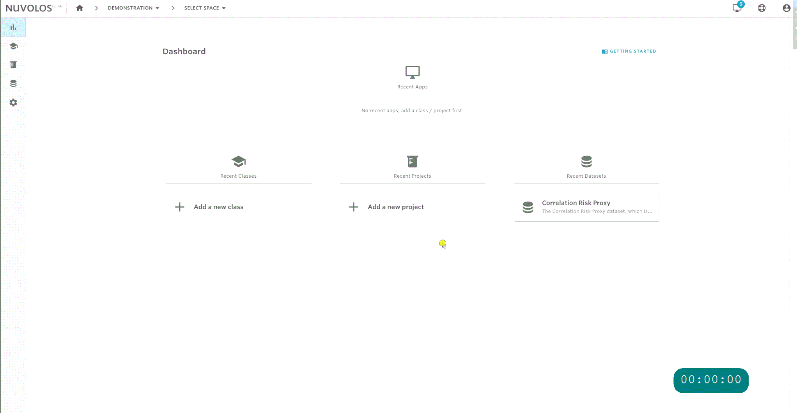
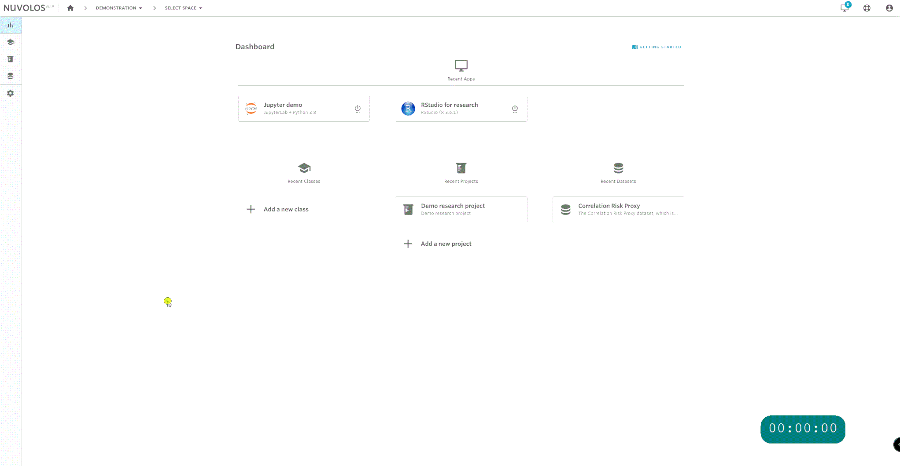

# Datasets

## Start working with data

Nuvolos differentiates two types of data:

1. Tabular data stored in some database management system
2. Data stored in regular files

This page describes working with _tabular data. ****_For working with files, consult [our guide](../getting-started/work-with-files/).


This documentation distinguishes tabular and file based data.

Tabular data means that stored in the Scientific Data Warehouse \(SDW\), a SQL compliant cloud-based data warehouse. 

File based data means data that is stored on a regular file system. This guide focuses on database-stored datasets.


## Dataset spaces

Datasets are special kinds of spaces, with the main goal of containing only tabular data and documentation related to that tabular data and potentially other descriptor files. For obtaining a full list of the datasets available to you in your current organization, navigate to your dashboard, and pick the datasets menu.


Datasets consist of immutable [snapshots](../our-features/snapshotting.md). Datasets are to be used as sources of distribution, not to directly work in.


## Distribute data you need

Suppose that your project is called 'Demo research project' and you need two tables from the 'Correlation Risk Proxy' dataset.

Using the distribute feature, you can set your research project up with the required data:

## Work with data in your workspace

Once the distribution has completed, you will receive an e-mail to your account you registered with. If the distribution was successful, the data should be available in the instance you distributed to.

You will now be able to work with data in your workspace, without having to worry about backing up your data and causing inadvertent changes.

Please follow our detailed guides:

* The [tables view](the-table-view/) helps you explore and write basic queries against tables.
* Once the structure of data is clear, we suggest [working from applications](access-data-from-applications/) with data.
* Some[ worked examples](work-with-specific-datasets/crsp-and-compustat.md) demonstrate the power of Nuvolos.

