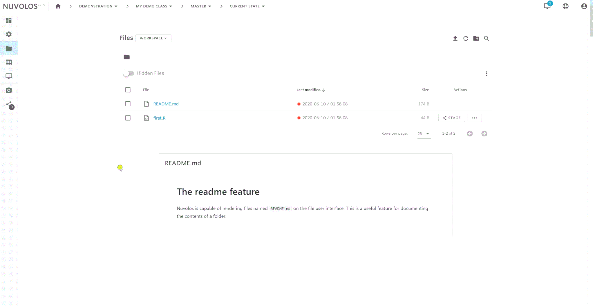
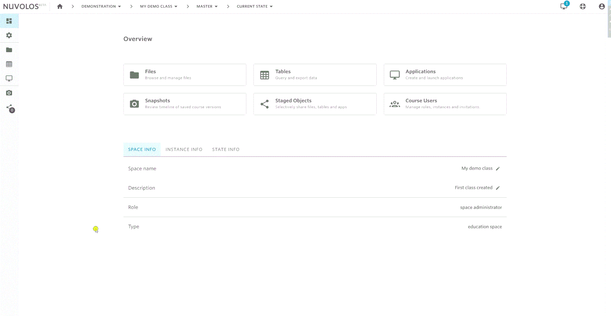
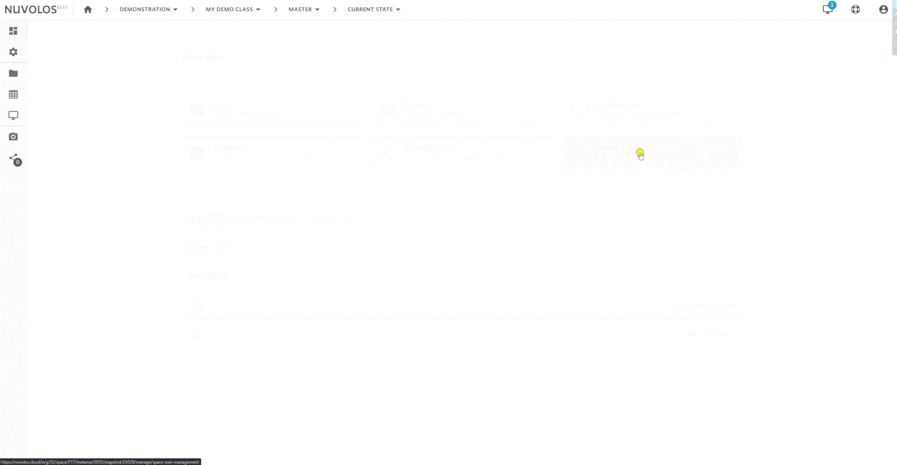

# Instructor guide

## Setting up a class

Assuming that you have acquired access and have the rights to create a class, you can set up a class via the steps as follows:

## 

As visible in the animation, you can choose to add an application to the class immediately upon setup, or delay this step to a later time.

## Adding teaching material

By teaching material, we generally understand code and documents that are stored as files on your machine. The following animation shows you how to navigate to the files of the master instance and upload some material.

## Distributing to prospective students

You can distribute the teaching material to prospective and existing students by using the distribute feature. For a very basic use case, we demonstrate how to distribute the two files uploaded previously.

The key steps of the process:

1. **Select the objects you want to distribute**
   * Not selecting anything will default to distributing everything from the current state of the instance.
   * Applications are automatically added to the distribution, you have the option to remove them.
2. **Select the target**
   * By default you will distribute to all students - every existing instance and future instance.
3. **Select the strategy**
   * By default overwrite is suggested, consult the detailed distribution documentation for other options and their use cases.
4. **Specify a message along with distribution**
   * Your current students will receive the message you specified to their e-mail address.

## Invite students

There are multiple strategies to inviting students. The options are:

* Invite them via a shareable link \(requires the least work from the instructors' side\)
* Invite them directly by specifying their e-mail \(good for small classes\)
* Invite them in groups \(only doable via e-mail\)

Students invited in this manner will only able to see their own workspace, not the master instance or other students' instances.

Obtaining a shareable link that you can post on your learning management system can be done as follows:

## Invite teaching assistants

Teaching assistants are able to see everything that is going on in the class, they have the _space admin_ role. Whoever created the class automatically becomes a _space admin_ as well. To invite teaching assistants with this elevated role, follow the instructions below.

