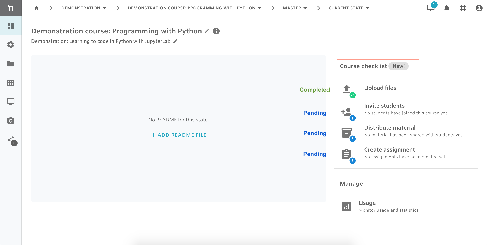
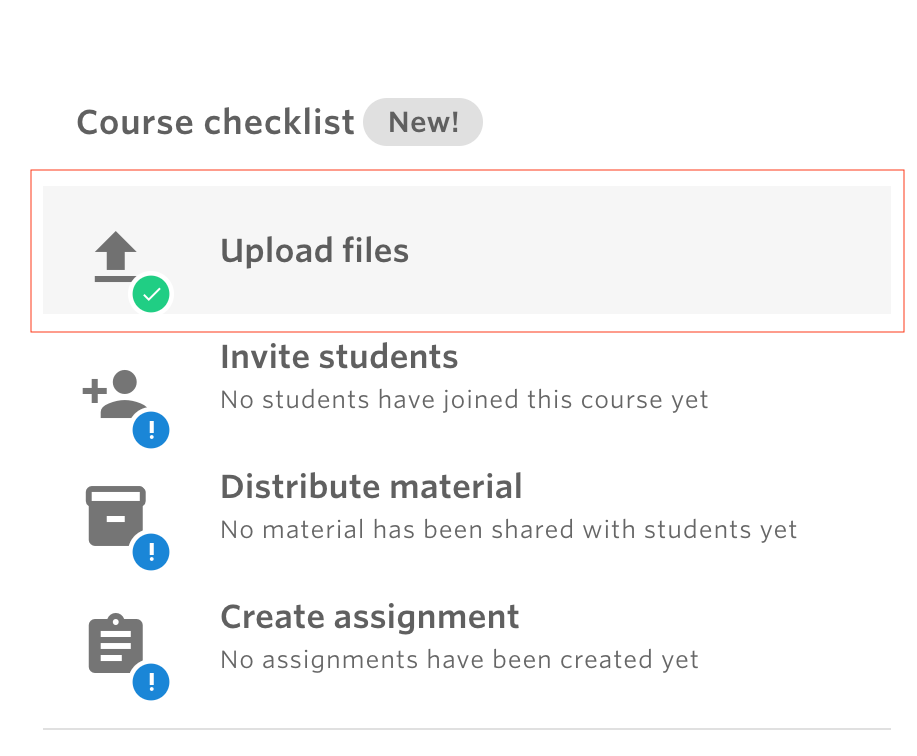
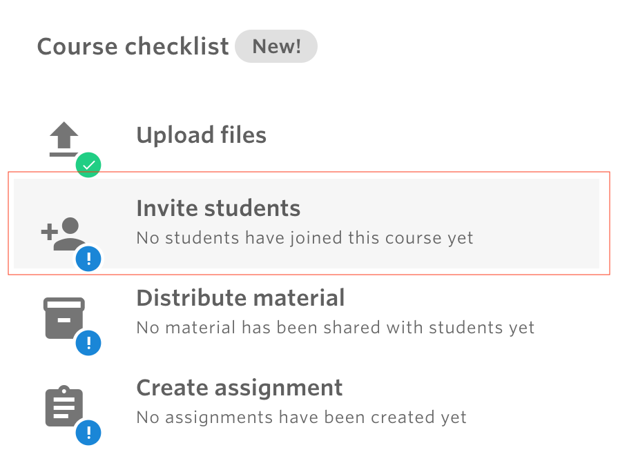
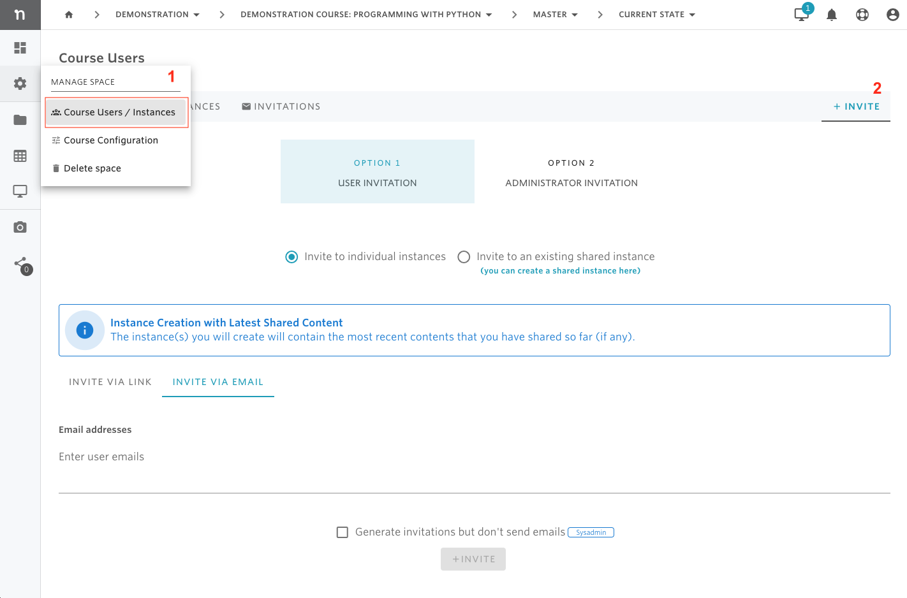

# Get started with a course


In most cases, it is possible to set up a course from scratch in less than 5 minutes.


## 1. Add a new course

Courses are spaces in Nuvolos where instructors add learning materials \(data, code and applications\) for their students. Organization managers and faculty members may create courses.

1. Navigate to _Courses_
2. Select + NEW COURSE 
3. Enter desired course name and description
4. Select + ADD SPACE
5. Select application
6. Enter desired application name
7. Select + ADD APPLICATION

## 2. Complete course checklist

To have a complete course setup, a list of operations is recommended to complete: uploading files, inviting students, distributing course material to the students, and creating assignments/exercises for students.

On the overview page of each course, course administrators can see the course checklist and the status of each list item \(completed or pending\). Below is a screenshot showing an example of a course checklist where only one item \(uploading files\) is completed while the other three items are pending.

###      2.1. Add teaching material

Course material consists of items like code, documents, or data files that are used to support learning. The following animation shows you how to navigate to the files of the master instance and upload course material.

Alternatively, you can click on the 'Upload files' tile in the Overview course checklist and it will directly open the file upload modal.

###      2.2. Invite students

To invite students, you can click on the 'Invite students' tile in the Overview course checklist and it will directly open the invitation dialog.

Ways to invite students to join the course :

* By sharing an Invite Link \(requires the least work from the instructors' side\).
* By e-mail \(good for small courses\)

Alternatively, more invitations options are available in the course users/instance view which can be opened from the sidebar as illustrated below


Invited students will be able to see only their workspace, not the master instance or other students' instances.


###     2.3. Distribute to prospective students

You can distribute the teaching material to prospective and existing students by using the distribute feature. For a very basic use case, we demonstrate how to distribute the two files uploaded previously.

The key steps of the process:

1. **Select the objects you want to distribute**
   * Not selecting anything will default to distributing everything from the current state of the instance.
   * Applications are automatically added to the distribution, you have the option to remove them.
2. **Select the target**
   * By default, you will distribute to all students - every existing instance and future instance.
3. **Select distribution strategy**
   * By default overwrite is suggested, consult the detailed distribution documentation for other options and their use cases.
4. **Specify a notification message**
   * Your current students will receive the message you specified to their e-mail addresses. 

###     2.4. Create an assignment

For instructions on how to create an assignment, please check the documentation page on assignments [here](assignments.md).

## 3. Invite teaching assistants

Teaching assistants are able to see everything that is going on in the course, they have the _space admin_ role. The user who created the course automatically becomes a _space admin_ as well. To invite teaching assistants with this elevated role, follow the instructions below.

## 4. Best practice: Structuring your course

As described in the structure document, a space \(in particular, a course\) consists of multiple instances. As a space administrator of your course, you have complete control over how many instances your space might have and which students may access what instance.

### Suggested layout

In the suggested standard layout:

* All instructors \(professors and teaching assistants alike\) control the teaching material in the **master** instance. In terms of roles:
  * The professor and designated teaching assistants have space admin role in the space and edit material in the master instance.
* Every student is invited to their own instance, each student having the following roles:
  * Editor role in their own personal instance.
  * Viewer role on the distributed instance \(this is given by definition\).
* [Group work](set-up-group-work.md) is kept in a separate space, any specialized instances are not kept together with the standard layout.


The benefit of this layout is that the distribution target can be "All Students" without compromising integrity. 

In general, we suggest keeping your spaces simple if you have the ability to create multiple.


### **Alternate layout**

There are many alternate layouts possible as lined out previously. A particular example that has come up in a few cases:

* Some or all instructors work in separate instances.
  * The professor and designated teaching assistants have space admin role but agree to do course material development work in separate instances.
* Every student is invited to their own instance, each student having the following roles:
  * Editor role in their own personal instance.
  * Viewer role on the distributed instance \(this is given by definition\).


The benefit of this layout is that the master instance never has file editing collisions.

Distributions are complicated in this setup due to the fact that instructors may override each other's work during distribution. There is additional coordination required such that inadvertent overrides do not confuse instructors working in parallel.


