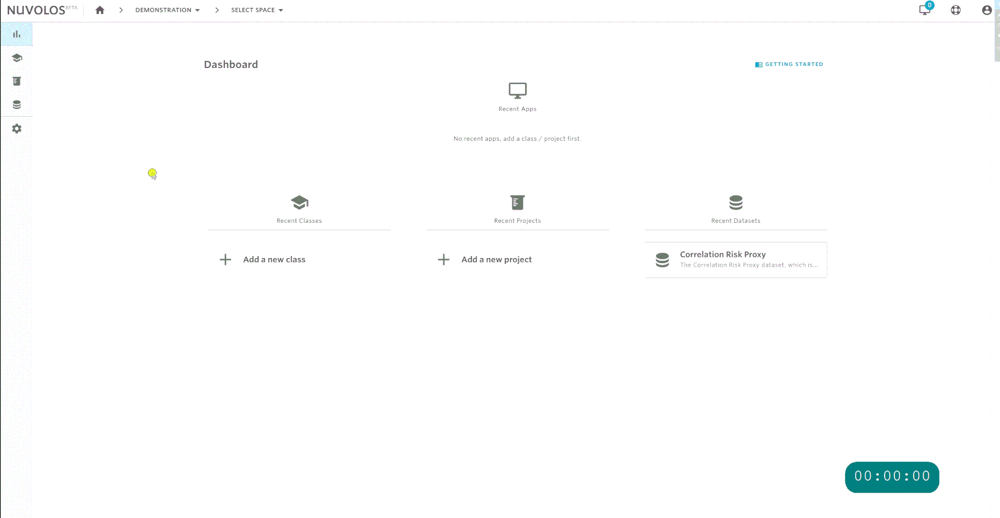
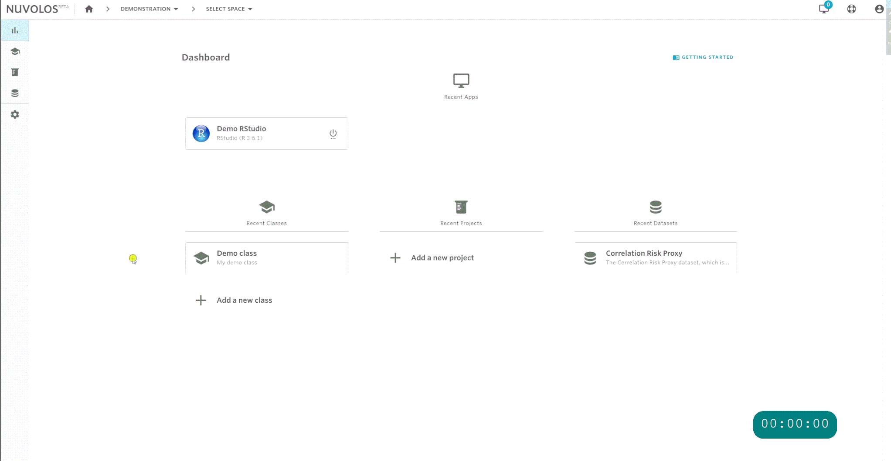
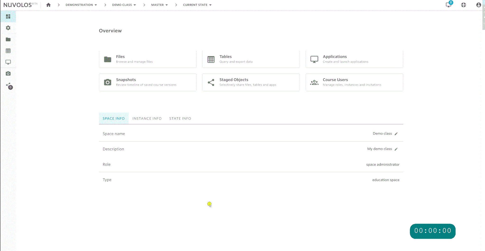

# Get started


In most cases, it is possible to set up a class from scratch in less than 5 minutes.


## Add a new class

Classes are the spaces in Nuvolos where instructors add learning materials \(data, code and applications\) for their students. Organization users \(manager or faculty\) may create courses.

1. Navigate to _Classes_
2. Select + NEW CLASS 
3. Enter desired course name and description
4. Select + ADD SPACE
5. Select application
6. Enter desired application name
7. Select + ADD APPLICATION

## Add teaching material

Course material are items like code, documents or data files that are used to support learning. The following animation shows you how to navigate to the files of the master instance and upload course material.

## Distribute to prospective students

You can distribute the teaching material to prospective and existing students by using the distribute feature. For a very basic use case, we demonstrate how to distribute the two files uploaded previously.

The key steps of the process:

1. **Select the objects you want to distribute**
   * Not selecting anything will default to distributing everything from the current state of the instance.
   * Applications are automatically added to the distribution, you have the option to remove them.
2. **Select the target**
   * By default you will distribute to all students - every existing instance and future instance.
3. **Select distribution strategy**
   * By default overwrite is suggested, consult the detailed distribution documentation for other options and their use cases.
4. **Specify a notification message**
   * Your current students will receive the message you specified to their e-mail address.

## Invite students

Ways to invite students to join the course :

* By sharing an Invite Link \(requires the least work from the instructors' side\)
* By e-mail \(good for small classes\)
* By Group invitation \(via e-mail\)

Invited students will be able to see only their workspace, not the master instance or other students' instances.

Invite with a Sharing Link:

1. Navigate to _Course Users_
2. Select + INVITE
3. Copy Sharing Link.

## Invite teaching assistants

Teaching assistants are able to see everything that is going on in the class, they have the _space admin_ role. The user who created the class automatically becomes a _space admin_ as well. To invite teaching assistants with this elevated role, follow the instructions below.

