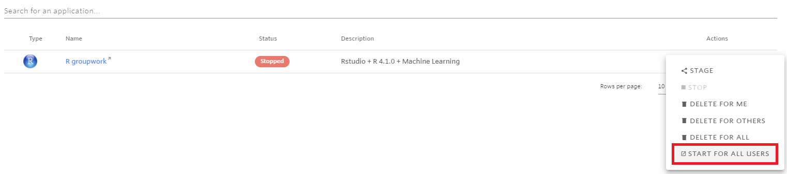
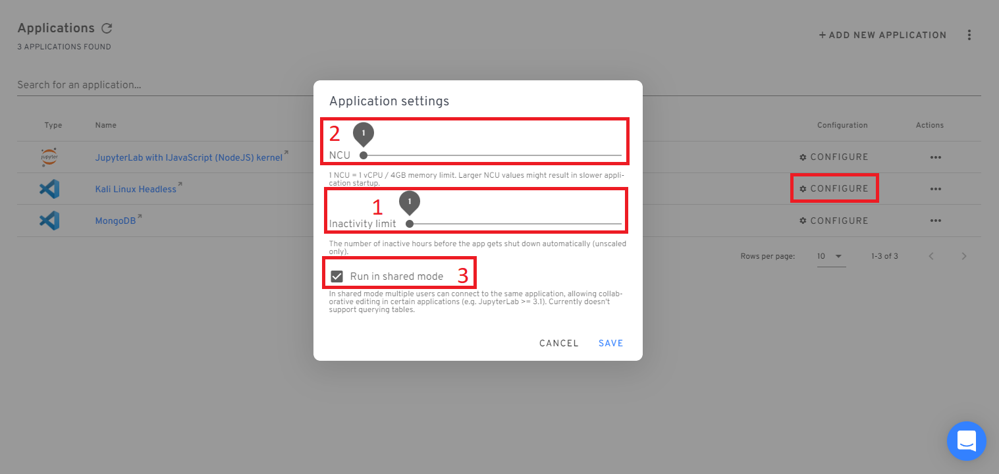

# Configuring applications

When working with student applications on Nuvolos, it is important to consider the following performance characteristics:

### Resource allocation time

If a class size is large \(e.g. above ~50 users / or if individual applications have been customized to request higher resources\) and students are expected to launch their applications at the same time, it can happen that resource allocation becomes slower \(e.g. application launch time can be around 5 minutes instead of the usual 30-60 seconds\). 

For a good user experience, we recommend that instructors pre-launch the required application\(s\) for all users around **30 minutes before** students are expected to start work with it.


Student application are stopped automatically after 1 hour of inactivity, so it does not make sense to perform the pre-launch more than an hour before the planned start time.


Pre-launching can be performed from the 'Applications' view on the sidebar, by clicking the three dots besides the application name and selecting the "Start for all users" option:

Pre-launching will start the application for all users in the space: for students, their respective applications will be started, for space administrators the application in the master instance will be started. In case a space administrator is also an editor in a student instance, that application will also be started for the administrator.

### Configuring applications

Each application can be configured by a space administrator. The following aspects may be customized:

1. Application inactivity timeout
2. Application resources
3. Shared access

All of these items can be found by clicking on **Configure** in the Applications view of an Instance.

#### Configuring application inactivity timeout

Please refer to our documentation of [inactivity](https://docs.nuvolos.cloud/getting-started/work-with-applications/long-running-applications#automatic-stopping-due-to-inactivity) for details on what we understand on an application breaching the inactivity limit. The slider changes the amount of time \(in hours\) after which the application is shut down if it is inactive during the time period. If you distribute an application, the setting at the time of distribution is also enforced at the target application.


Increasing the inactivity limit may result in higher-than-desired resource utilization of your organization.


#### Configuring application resources

Resource availability to applications running in non-exclusive environments is understood in Nuvolos Compute Units \(NCUs\). For a detailed description of NCUs, you may refer to its [documentation](https://docs.nuvolos.cloud/settings-and-administration/billing-budgeting-and-resource-pools/nuvolos-compute-units#definition). You may scale the NCU allocation of an application to a higher or lower level depending on the expected workload of the application. If you distribute an application, the setting at the time of distribution is also enforced at the target application.


Increasing the NCU utilization of an application may result in higher-than-desired resource utilization of your organization.


#### Configuring shared access

Applications can be configured to be shared access in case shared group work is expected from users of an instance. Please refer to our detailed guide [here](set-up-group-work/collaborative-editing.md).

### Performance sensitive code

On Nuvolos each student runs the code with the same application configuration as the instructor.

Nevertheless it is important to consider that when many students are concurrently executing a computationally intensive code, the application performance might be inferior to what the instructor experienced during material development when potentially the load from other users was lower.

Whilst usually this is within a reasonable factor, we recommend that during **interactive sessions with a large number of students**, either:

a\) Code examples should be adjusted such that  they execute within a minute or so maximum.

b\) The space should be configured to have larger per-student resources to provide adequate compute performance. For the most performance sensitive cases, we suggest dedicated compute nodes for each application - please reach out to our support team to discuss such an option.

For out-of-class work when concurrency is lower, these considerations can be appropriately relaxed.

