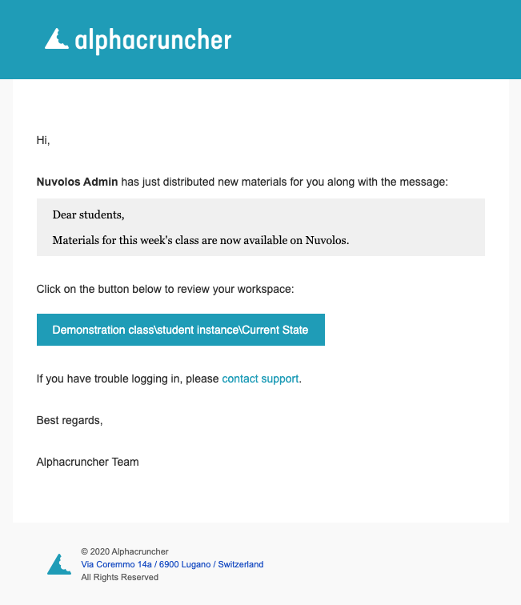
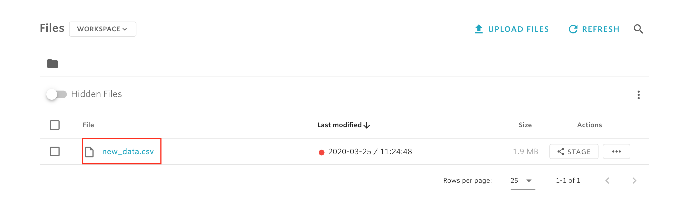
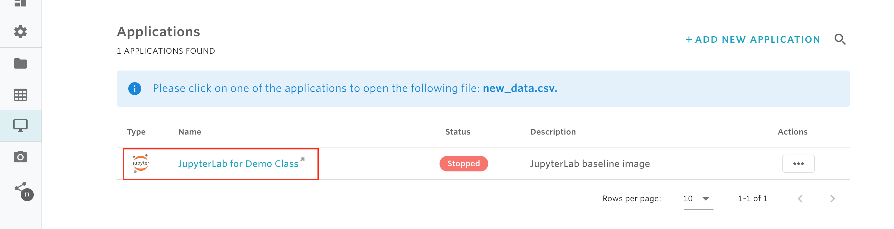
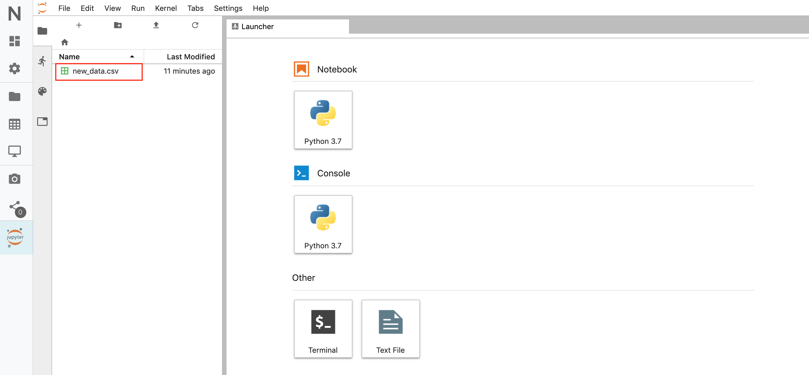

# Review distributed material

As a student, you are likely to receive material that has been distributed from your teacher. Once the teacher shares new material with you, you will receive a notification email where you can review what was shared. Below is a screenshot of how the review email looks like:

From the email, click on on the blue button \(which contains as a text the full location of your instance \(here sketched in red\)**\)** to see your list of files. For example, suppose your teacher shares a new file called **new\_data.csv** with you, then the new file will be displayed in the list of workspace files \(see the screenshot below\).

To work with the newly distributed files using one of your applications, simply click and select "Open. This will take you to the list of your applications. Click on any of the applications you want to work with and then you will see the file listed in the console of the application. For example, assume we want to work the file new\_data.csv with Python, then we can do this via a JupyterLab application as follows

