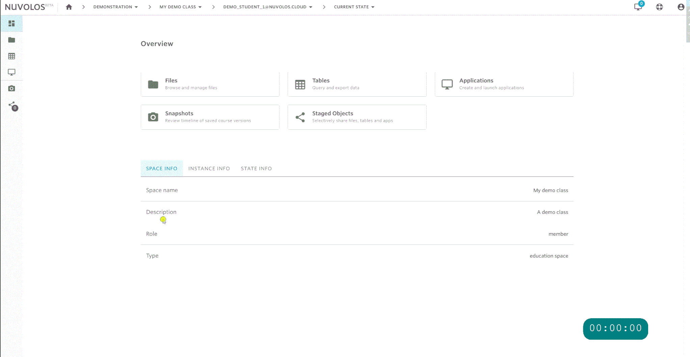
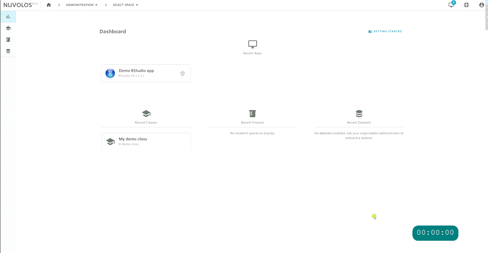
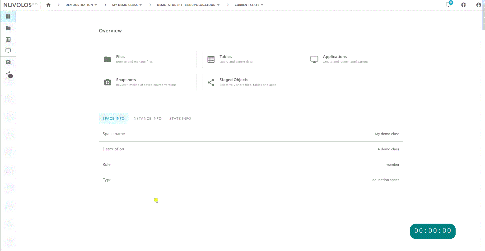

# Enroll in a course

## Generate invitation

If you received an invitation link directly from your instructor, you will have to either click on it or navigate to it in your browser. The invite link should look something like this: https://nuvolos.cloud/enroll/class/4963cd4b1355488f35f874c6f9f4116e0e

1. Provide your educational institution e-mail address.
2. Check the invitation in your email inbox.

## Accept your invitation

You can only work with Nuvolos if you have received a valid invitation. The below steps show you how to accept an invitation to your own instance in a particular class in Nuvolos.

1. Open your e-mail account and navigate to the invitation mail.
2. Click the **Review Invitation** button in the invitation mail.
3. Inspect the roles included in the invitation.
4. If you have never signed up, sign up.
5. Click the accept invitation button.
6. If this is the first time you are signing up, the process might take about a minute to complete.

## Sign in

You can sign in via two routes:

1. Users affiliated with a Swiss higher education institution, select the SWITCH option.
2. Otherwise, use the regular sign-in option.

## Access your class material

1. Click the tile of your class on the dashboard.
   * Mind the fact that your context has changed in the breadcrumbs to your personal instance.
2. Click the file view on the overview of your personal instance.

## Download or upload material

1. Navigate to your files view.
2. There are both upload and download buttons and you can also create a folder for example for your homework.

## Start an application

1. Applications can be started from the dashboard directly.
2. Applications can also be accessed from the application menu of your instance overview.


Application startup will take approximately 30 to 60 seconds. For certain applications, the first startup might take longer depending on the amount of setting and package files that needs to be copied. 


## Snapshot your work

1. You can take a snapshot by clicking the Photo camera button once you are in the context of your instance.
2. Fill out the details. If you don't want to spend energy, you can just create a **quick snapshot**.

