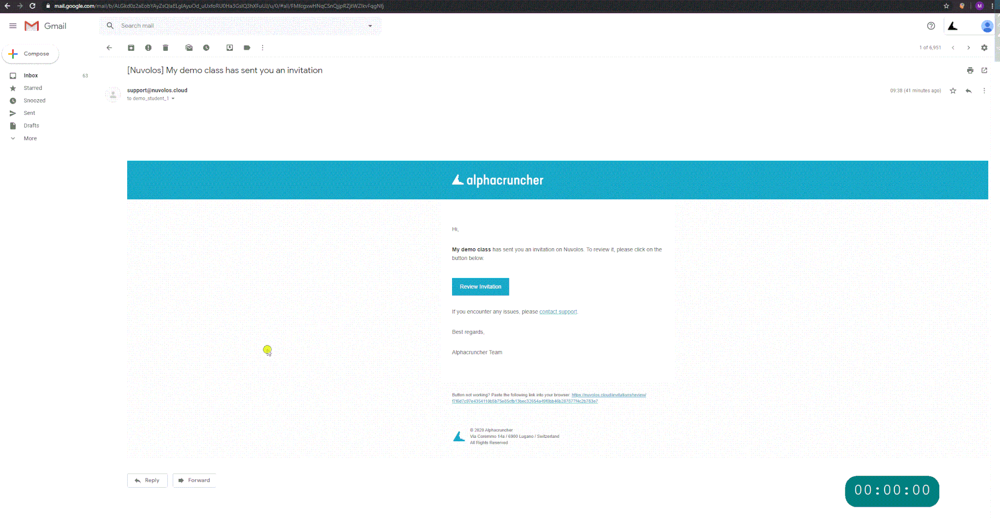

# Enroll and get started

## Generate invitation 

_If your instructor shared a sign-up link with you, you will have to generate an invitation for yourself._ 

1. Click or paste the link into your browser.
2. Give your e-mail address, we strongly suggest using your university e-mail address.
3. You should find the invitation in your mail box. Check your spam filter if the e-mail does not arrive.

## Accept your invitation

You can only work with Nuvolos if you have received a valid invitation. The below steps show you how to accept an invitation to your own instance in a particular class in Nuvolos.

1. Open your e-mail account and navigate to the invitation mail.
2. Click the **Review Invitation** button in the invitation mail.
3. Inspect the roles included in the invitation.
4. If you have never signed up, sign up.
5. Click the accept invitation button.
6. If this is the first time you are signing up, the process might take about a minute to complete.

## Sign in

You can sign in via two routes:

1. Users affiliated with a Swiss higher education institution, select the SWITCH option.
2. Otherwise, use the regular sign-in option.

## Access your class material

Clicking the tile of your class on the dashboard will immediately take you to your own instance in your class. By switching to the files view in the current state of your instance, you will be able to see all the teaching material that has been distributed to you so far.

## Download or upload material

The files view provides both an upload and download button, so it is possible to work on any remote machine and upload at any point to Nuvolos.

## Start an application

You can start your application right from the dashboard if it is a recently used one, or you can navigate to your instance and start your application from the Application view.

## Snapshot your work

You can take a snapshot by clicking the Photo camera button once you are in the context of your instance.

