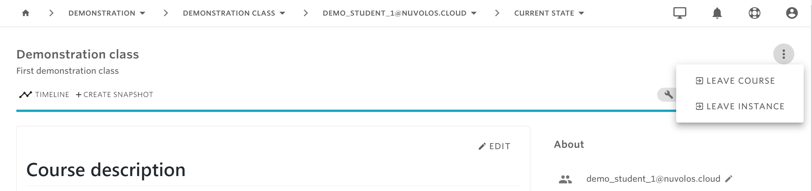

# Unenroll from a course

It might happen that as a student you decide to not take on the challenge of a course any more. 


Clarify with your professor and institution the unenrollment policy. Nuvolos is currently **not** linked to any institutional administrative systems, so there if there are administrative steps to be taken to unenroll formally from the course at your institution, you have to make those steps yourself. Nuvolos support cannot offer you guidance on steps relating to your institution.


Once you clarified the steps to be taken, on Nuvolos you can remove yourself from a course by finding the leave course menu from the top left corner of your overview. 

Leaving a course will remove your roles in the course \(any viewer and editing role\), however your instance will not be deleted - you might change your mind later or what you have already stored might be required by your institution at a later point in time.

