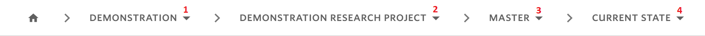
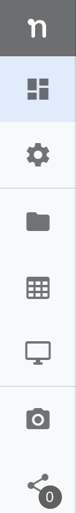

# Navigate in Nuvolos

Navigation in Nuvolos is closely linked to the [structure of Nuvolos](../our-features/data-organization/). The user can understand their position and navigate using the following highlighted parts of the user interface.

1. The **Nuvolos** logo
2. The **breadcrumbs**
3. In lower level views, the **sidebar.**

## The Nuvolos logo

The Nuvolos logo will always take the user to the _Dashboard._

## The breadcrumb

The breadcrumb is a sequence of selectable drop-down lists that allows the user to choose the organization \(level 1\), space \(level 2\), instance \(level 3\), and state \(level 4\). For example, if the user is looking at a state overview, the breadcrumb will look like the following:

In the above breadcrumb, the following information is available:

* The user is currently in the "NEW ORGANIZATION" organization.
* The user is in the "NO NAME" space inside the organization.
* Inside the space, the user is working in the "MASTER" Instance.
* Inside "MASTER", the user is working with the "CURRENT STATE", which is the mutable state.

As visible, the breadcrumb can take the user either to the Dashboard \(via the home icon\), or the user can change the organization, space, instance, or snapshot where one of the following could happen:

* If the user changes the organization, then the interface will redirect to the dashboard and a space needs to be selected.

* If the user changes the space, then three scenarios are possible depending on the rule the user has in the particular space:
  * If the user is an administrator of the space, then they will be taken to the "CURRENT STATE"  state of the "MASTER" instance of the selected space.
  * If the user is not a space administrator but has an editor role in one of the instances, then they will be taken to the "CURRENT STATE" state of that instance.
  * If the user is not a space administrator or an instance editor, then they will be taken to one of the immutable states of an instance where the user is a viewer.

## The sidebar

The sidebar is only visible once you are viewing your work on the state level.

The layout is the following:

From top to bottom the icons will take the user to the following views \(also visible by hovering over an icon\):

* Overview
* Settings \(Invitations, settings, deletion\)
* Files
* Tables
* Applications
* Snapshot operations \(create a snapshot, view snapshots\)
* Object distribution


The currently active view is highlighted with a darker background.


