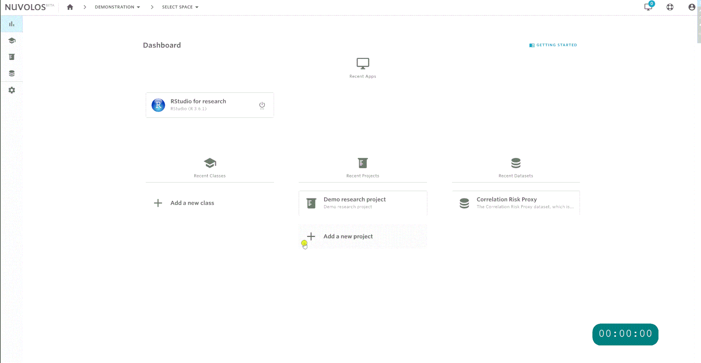

# Work with applications

In Nuvolos, each application is a separate entity with a separate set of resources and environmental settings. Some important considerations:

1. You can have multiple applications of the same type \(e.g. RStudio\) in the same instance with different sets of packages or package versions.
2. When you [take a snapshot](../../settings-and-administration/instance-management/create-a-snapshot.md), applications are snapshot along with all the packages, environmental files and so on.
3. Applications can be distributed \(see above\).

## Table of contents

* Elementary topics are collected on this page.
* How to [find an application](find-an-application.md).
* [Install packages](install-a-software-package.md) to your applications

## Create a new application

In the workflow guide, we previously created an RStudio application upon creating the space itself. We will add a JupyterLab application to the Master instance of the research project.

1. Navigate to the Master instance overview \(from the dashboard or by changing context in the [breadcrumbs](../navigation-in-nuvolos.md#the-breadcrumb)\)
2. Click on the Applications tile or sidebar menu item.
3. Click "ADD NEW APPLICATION" and choose the appropriate type.

## Run an application

In order to run an application, you can follow two routes:

1. Run a recent application from your dashboard.
2. Navigate to the instance of your choice and run the application directly from there.

#### Running from dashboard

The three latest applications will appear on your dashboard. You can verify the location of the application by hovering over the start-stop button.

#### Running from an instance

You can navigate to the application view of your instance and find the list of applications there.

We present a hybrid of the two approaches by showing how to find the recent applications' instance and running it from there:

