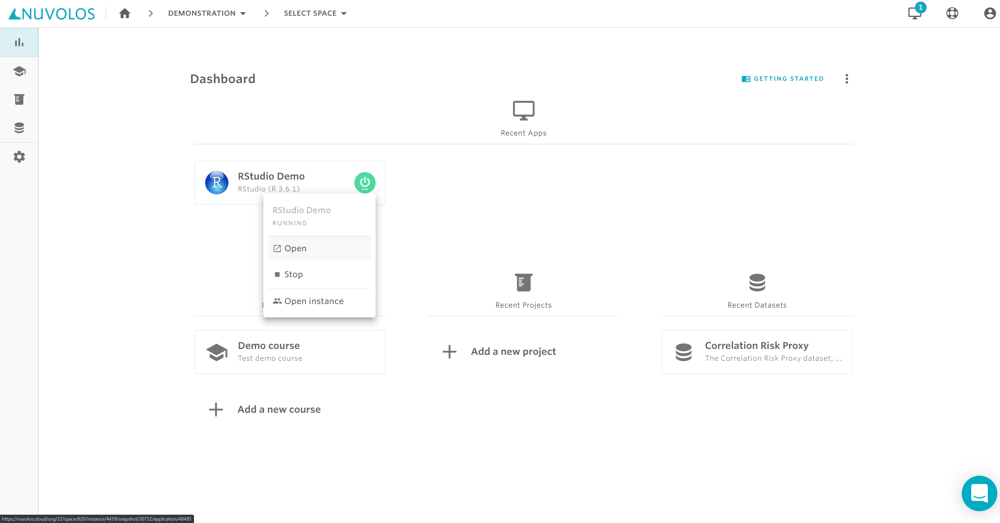
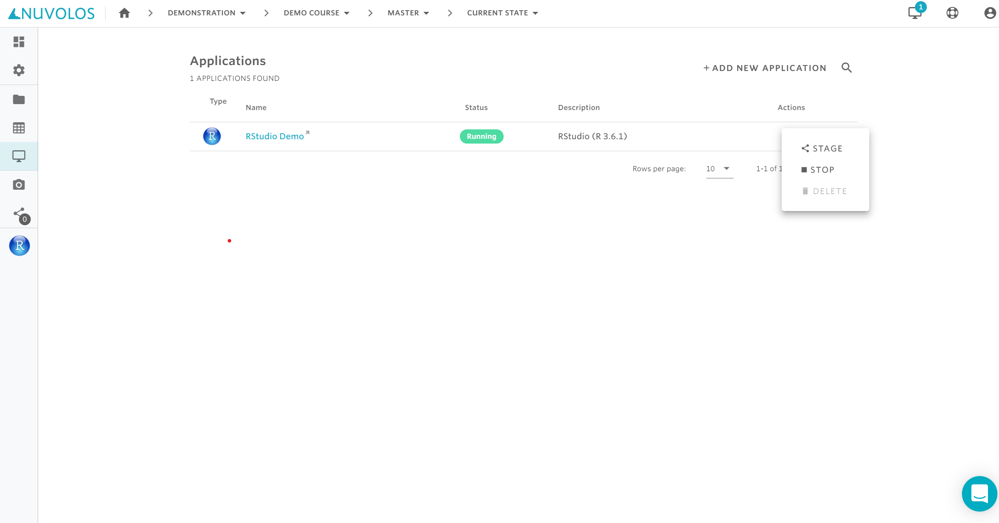

# Work with applications

In Nuvolos, each application is a separate entity with a separate set of resources and environmental settings. Some important considerations:

1. You can have multiple applications of the same type \(e.g. RStudio\) in the same instance with different sets of packages or package versions.
2. When you [take a snapshot](../working-with-snapshots/create-a-snapshot.md), applications are snapshotted along with all the packages and environmental files.
3. Applications can be distributed \(see above\).

## Table of contents

* Elementary topics are collected on this page.
* How to [find an application](find-an-application.md).
* [Install packages](install-a-software-package.md) to your applications

## Create a new application

In the [workflow guide](../../research/), we previously created an RStudio application upon creating the space itself. We will add a JupyterLab application to the Master instance of the research project.

1. Navigate to the Master instance overview \(from the dashboard or by changing context in the [breadcrumbs](../navigation-in-nuvolos.md#the-breadcrumb)\)
2. Click on the Applications tile or sidebar menu item.
3. Click "ADD NEW APPLICATION" and choose the appropriate type.

## Run an application

In order to run an application, you can follow two routes:

1. Run a recent application from your dashboard.
2. Navigate to the instance of your choice and run the application directly from there.

#### Running from dashboard

The three latest applications will appear on your dashboard. You can verify the location of the application by hovering over the start-stop button.

#### Running from an instance

You can navigate to the application view of your instance and find the list of applications there.

We present a hybrid of the two approaches by showing how to find the recent applications' instance and running it from there:

## Stop an application

Stopping applications once they are not used anymore is a good practice: you stop using resources allocated to your organization.

 There are two ways to stop your application.

1. From the dashboard, or
2. from the instance overview.

### Stopping via the dashboard

On the dashboard, the three most recently used applications are always listed. Hovering over the "power button" lets you either enter the instance the app is located in, open the app directly or stop it if the app is running:

### Stopping via the application view of an instance

If you are visiting an instance, it is possible to view the list of applications on the Applications view \(see previous sections\). Here, it is also possible to a running app by opening the actions menu:

### Auto-stop for applications

Nuvolos can also [automatically stop unused applications](long-running-applications.md#automatic-stopping-due-to-inactivity).

