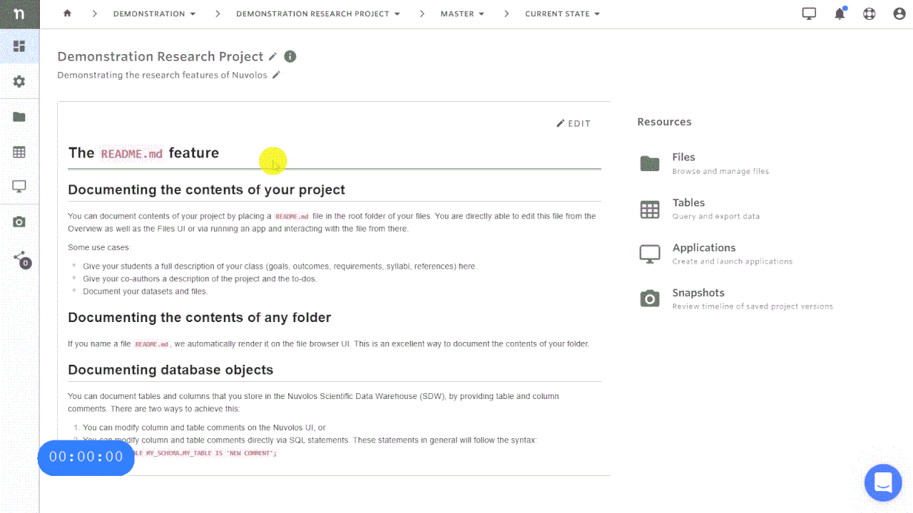

# Create an application

## Create a new application

1. Navigate to the instance overview and make sure you are viewing the current state. 
2. Select the Application icon which looks like a computer screen. 
3. Click "ADD NEW APPLICATION" in the top right corner. 
4. Select the type and version of the application, and provide a name and \(optionally\) a description. If you miss a particular application from the list available to you, please contact your organization manager. 
5. Click "ADD APPLICATION".

**If you are encountering a problem creating an application, refer to the troubleshooting guide** [**here**](../../troubleshooting/application-issues/cannot-create-an-application.md)**.**

## 

  

\*\*\*\*

