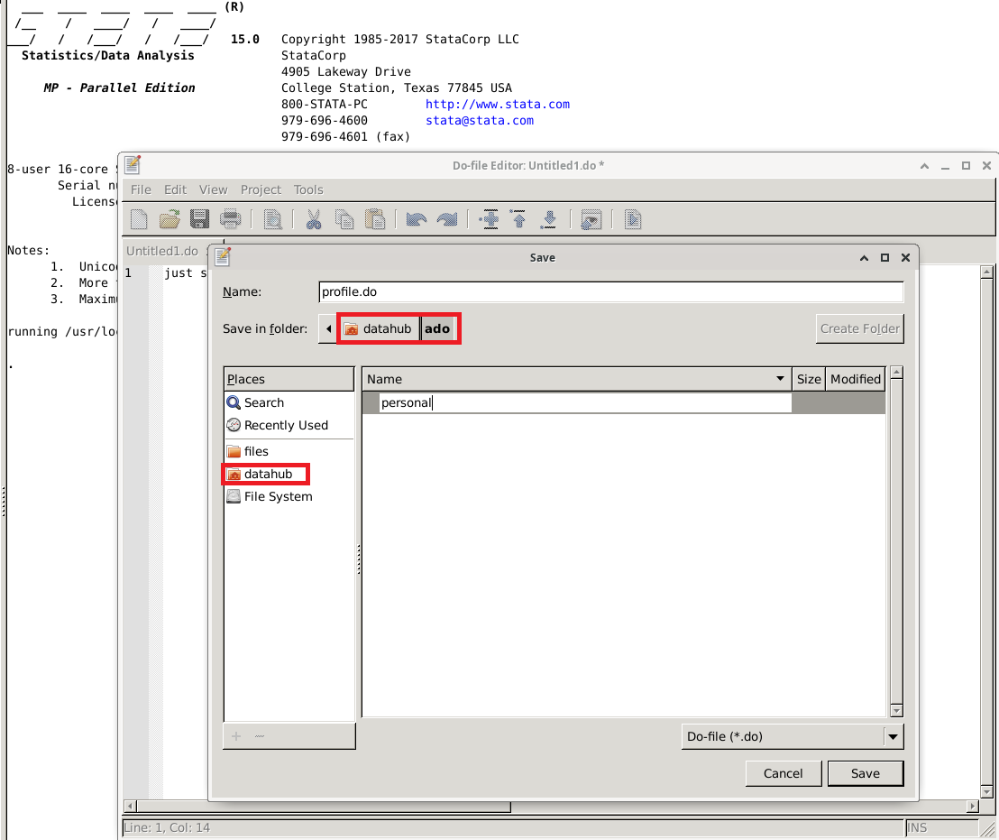

# Stata

This guide contains suggested tips and tricks related to working with Stata on Nuvolos.

## Profile.do files

Stata is configured with a `sysprofile.do` file, which loads the Nuvolos database connection string into the global macro `conn_str`. 

You might also want to specify your own startup Stata commands. This can be done by creating a do file under `~/ado/personal/profile.do`. The folder ~/ado/personal does not exist by default, you will have to create it once. 

### Creating your personal folder

There are multiple ways to do this. The simplest and most time efficient one is to use Stata's interface to create the folders and then save the file:

Make sure to save the file by selecting the home icon with datahub first - this is your home folder and Stata will look for the `ado/personal` folders there.

