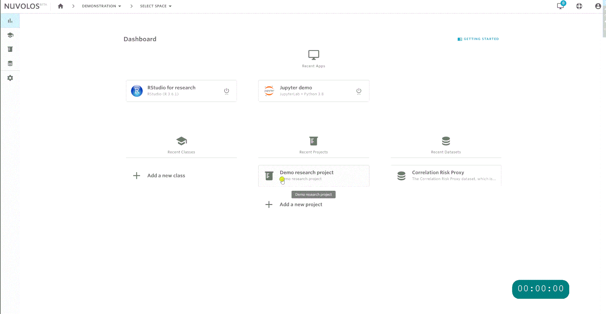
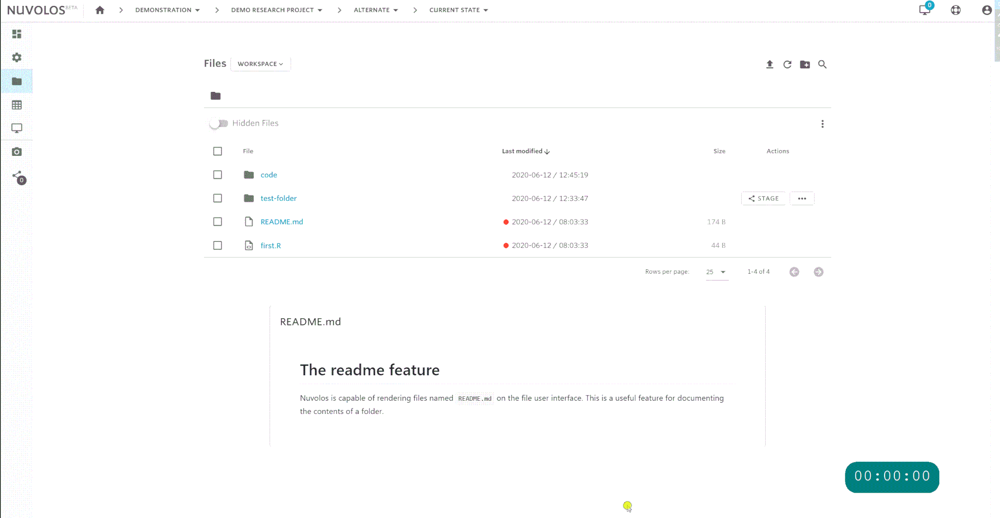
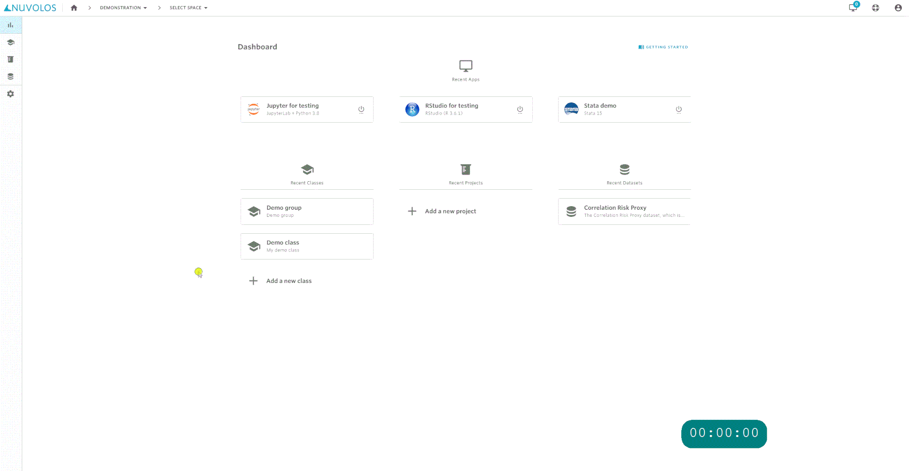
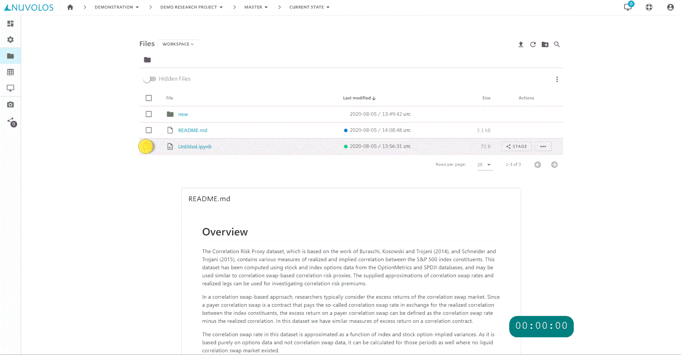
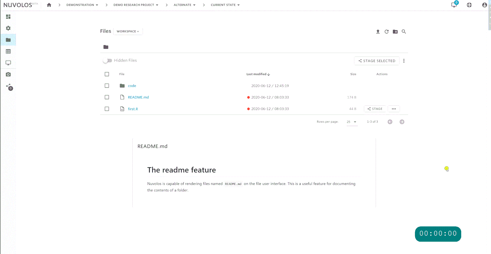
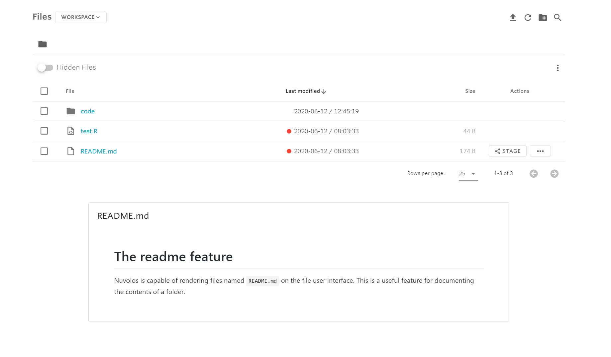

# Work with files

## Choose your context

In all of the following operations, we assume that you know how to pick the appropriate context for your work \(that is, finding the current state of an instance in which you are implicitly or explicitly an editor\).


Only current states can be modified - snapshots are immutable!


As an example:

## Create a folder

After navigating to the files view of the instance you are working in:

## Upload files

You can upload files and folders with the upload button.

In case you cannot upload a file due to it being extremely large, you can do the following:

1. [Create a JupyterLab application](work-with-applications/create-an-application.md). 
2. Use the upload feature in JupyterLab:

## Download files

You can download a file by selecting it and finding the download button:

## Delete files

You can delete one or more files by selecting them and then finding the delete button.

## Move files

You can move files around in the directory structure using the following flow:

## Copy files

You can copy a file to a different folder using the following steps:

## Rename files

You can rename a file by selecting it and finding the rename button:

## The diff feature

It is possible to view the difference of two text files in two different snapshots. In this example, we assume that there was a snapshot taken in the instance.

* An orange dot next to a filename means that the file has not been snapshot yet.
* A blue dot next to a filename means that the file has been snapshot and has been changed since the last snapshot taken.
* A green dot next to a filename means that the file has been snapshot and has not been changed since the last snapshot taken.

Hovering over the dot pops up the diff menu:

## The readme feature

If you create a file named `README.md` in a folder, the user interface of Nuvolos will try to interpret and render it as a markdown file. **The** `README.md` **created in the root directory will also be displayed on the space overview page.**

As an example:


You can do this in _every folder_ if you want to - this is a great way to document contents of folders beyond the usual filename information you can provide yourself!


## 

