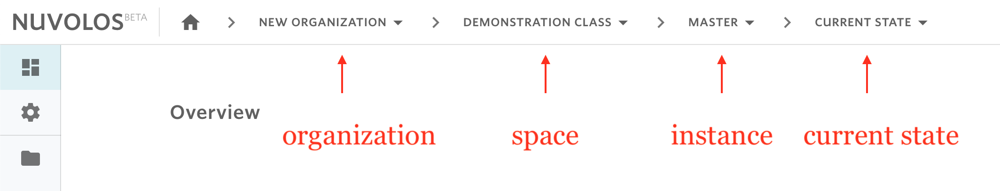
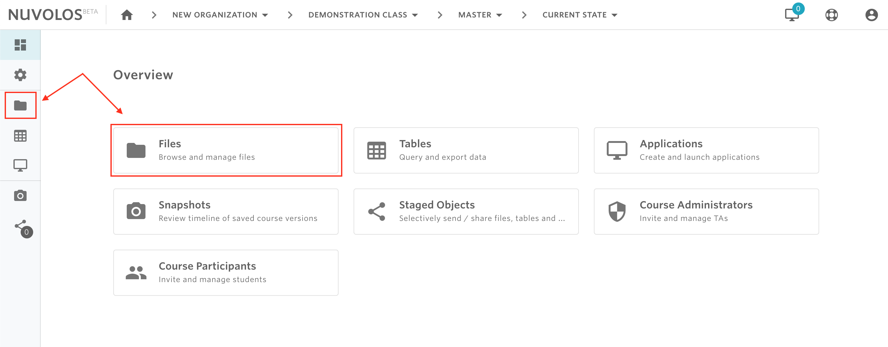
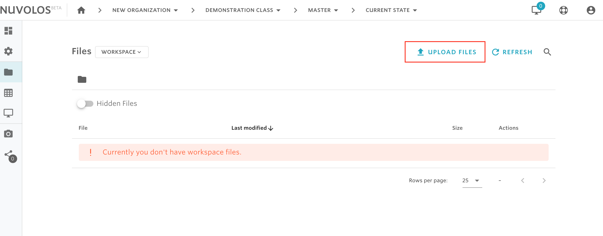
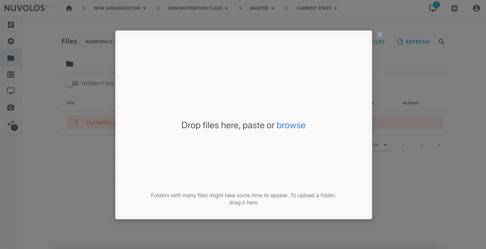

# Upload files and folders


Uploading files is only possible if you are in the current state of an instance.


## To upload files and folders:

1- Open the space and instance where you want to upload the files. This can be done via the toolbar breacrumbs. Make sure you are viewing the current state of the selected instance. 

For example, let say we want to upload files to the Master instance of the space "Demonstration Class" in the "New Organization" organization, then using the breadcrumbs we should select the following:

2- Navigate to the files view. This can be done via the left sidebar or, if you are in the Overview page, via the Files tile.

3- From the top right, click on "UPLOAD FILES" and a dialog will open.

* To upload specific files, click on "browse" and select the files to upload.
* To upload an entire folder, drag the folder into the dialog.

4- Click on the green upload button.

